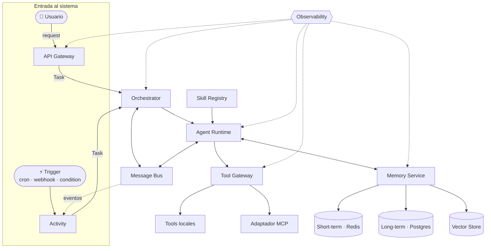
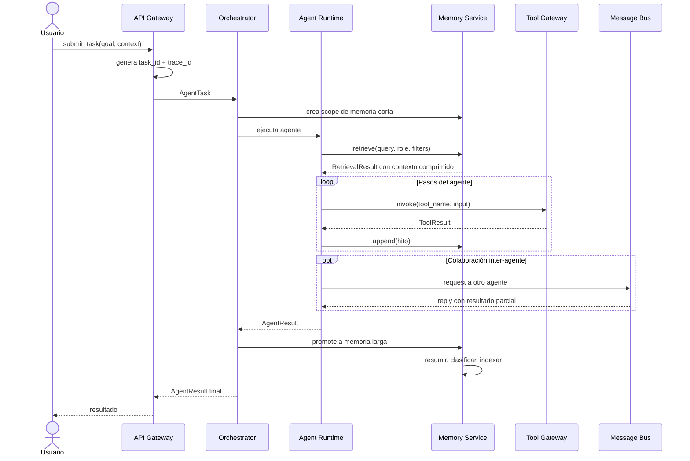
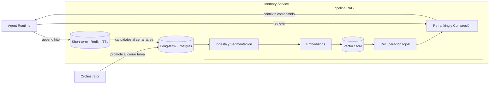

# Arquitectura Base: Plataforma de Agentes Sandbox

## 1. Objetivo
Construir una base reutilizable para crear agentes especializados con `tools` y `skills`, y permitir su intercomunicación de forma segura, trazable y extensible.

## 2. Glosario (definiciones clave)

### Conceptos fundamentales

**Usuario**
Persona o sistema cliente que envía objetivos. Nunca interactúa directamente con subagentes; siempre entra a través del `Orchestrator`.

**Agente (`Agent`)**
Unidad de razonamiento autónoma con un rol definido (p.ej. `supervisor`, `planner`, `coder`, `reviewer`). Decide qué pasos dar y delega la ejecución en `Tools`.

**Tool**
Capacidad ejecutable con efectos observables: leer un archivo, llamar una API, consultar una base de datos. Toda tool tiene un contrato formal (`ToolSpec`).

**Skill**
Paquete de conocimiento y comportamiento que especializa a un agente. Guía cómo razona y actúa; no ejecuta acciones directamente (eso es responsabilidad de las `Tools`).

**Task**
Unidad de trabajo enviada al sistema. Tiene un objetivo concreto, un ciclo de vida (`pending → running → blocked → completed | failed`) y produce un resultado. Puede ser creada por un usuario o por una `Activity`.

**Activity**
Entidad persistente y proactiva que genera `Tasks` en respuesta a `Triggers` o eventos del sistema. Representa el comportamiento autónomo sin intervención directa del usuario.

**Trigger**
Lo que activa una `Activity`: temporal (`cron`), externo (`webhook`), condicional (umbral de métrica) o reactivo a un evento del sistema.

**Orchestrator**
Coordinador central. Recibe tareas, selecciona agentes, aplica políticas y consolida resultados. No ejecuta lógica de negocio directamente; delega en agentes y tools.

**Memory**
Conocimiento del sistema en dos capas: corto plazo (estado temporal por tarea, con TTL) y largo plazo (persistente entre tareas). Incluye recuperación por similitud (RAG) para enriquecer el contexto del agente antes de cada ejecución.

**Message Bus**
Canal de comunicación interna. Transporta eventos entre componentes (pub/sub) y permite coordinación directa entre agentes (request/reply).

---

### Organización del trabajo

**Workspace**
Nivel de agrupación más alto. Agrupa proyectos de un usuario o equipo. Define identidad, permisos globales y contexto de facturación.

**Project**
Contexto persistente que agrupa tareas relacionadas. Define objetivo general, constraints compartidos, skills habilitadas y scope de memoria larga. Permite que los agentes acumulen conocimiento entre tareas.

---

### Ejecución interna

**Plan**
Salida del agente `planner`: secuencia ordenada de `Steps` con dependencias y posibles ramificaciones condicionales.

**Step**
Unidad interna de trabajo generada al descomponer una `Task`. No es visible para el usuario; es interna al `Orchestrator` y al `Agent Runtime`.

**Run**
Ejecución concreta de una `Task`. Si una tarea se reintenta, pueden existir múltiples `Runs` para la misma `Task`, cada una con su propio `trace_id`.

**Artifact**
Salida tangible producida por un agente durante una `Run`: archivo, código, documento, diff o datos estructurados.

---

### Gobernanza

**Policy**
Reglas que el `Orchestrator` aplica sobre tareas y agentes: timeouts, reintentos, presupuesto de tokens/coste, y qué agents/tools están permitidos. Puede definirse a nivel de `Workspace`, `Project` o `Task`.

**Capability**
Permiso concreto otorgado a un agente o tool. Es la unidad del modelo sandbox. Ejemplos: `fs:read`, `network:external`, `memory:long-term:write`.

---

### Comunicación y trazabilidad

**Event**
Algo que ocurrió en el sistema. Viaja por el `Message Bus` y puede ser consumido por cualquier suscriptor. Es la unidad fundamental de trazabilidad y de proactividad adaptativa.

**Trace**
Hilo que une todos los `Events` de una `Task` de principio a fin, identificado por `trace_id`.

---

### Componentes de plataforma

**Agent Runtime**
Proceso que ejecuta el loop de un agente. Gestiona contexto, selección de `tools`, memoria corta y formato de entrada/salida.

**Tool Gateway**
Capa única para registrar, validar y ejecutar `tools`. Centraliza seguridad y auditoría de todas las ejecuciones.

**API Gateway**
Punto de entrada externo. Expone operaciones de alto nivel (`submit_task`, `get_task_status`, `get_task_result`) y normaliza autenticación.

**Skill Registry**
Componente que descubre, valida y versiona `skills`. Expone el catálogo disponible al `Agent Runtime`.

**Observability**
Conjunto de logs, métricas y trazas para auditar comportamiento, diagnosticar fallos y medir costos.

**MCP (Model Context Protocol)**
Protocolo estándar para integrar fuentes externas (tools/resources). En esta arquitectura vive como adaptador dentro del `Tool Gateway`.

**RAG (Retrieval-Augmented Generation)**
Técnica donde el agente recupera contexto relevante desde memoria antes de generar su respuesta. Se implementa dentro del `Memory Service` como pipeline de ingesta, indexación y recuperación.

## 3. Principios de diseño
- Separar razonamiento (`agents`) de ejecución (`tools`).
- Definir contratos tipados para mensajes, memoria y tools.
- Centralizar coordinación y políticas en `Orchestrator`.
- Aislar permisos por agente y por tool (sandbox por capacidades).
- Mantener trazabilidad completa (`trace_id`, eventos, costos).
- Tratar la memoria y RAG como producto: calidad, gobernanza y ciclo de vida.

## 4. Componentes y límites de responsabilidad

### API Gateway (entrada de usuario)
- Recibe solicitudes externas.
- Normaliza autenticación/autorización de cliente.
- Publica estado y resultado por `task_id`.
- No ejecuta lógica de negocio de agentes.

### Orchestrator
- Crea y gobierna el ciclo de vida de tareas (`pending`, `running`, `blocked`, `completed`, `failed`).
- Selecciona agentes y secuencia de colaboración.
- Aplica políticas de control operativo.
- Gestiona scopes de memoria por tarea (`task memory scope`).
- Decide cuándo habilitar consulta RAG (por política, costo o criticidad).
- No llama integraciones externas de forma directa; delega a agentes y tools.

### Agent Runtime
- Ejecuta el loop de cada agente.
- Interpreta `skills` activas para orientar decisiones.
- Invoca `tools` vía `Tool Gateway`.
- Lee/escribe memoria de corto plazo durante la ejecución.
- Solicita contexto recuperado (RAG) al `Memory Service` cuando la tarea lo requiere.
- No gestiona transporte de mensajería global (eso pertenece a `Message Bus`).

### Memory Service
- Servicio especializado para lectura/escritura de memoria.
- Implementa dos stores:
  - `Short-term store`: key-value/document por `task_id` con TTL.
  - `Long-term store`: base persistente con metadatos y documentos normalizados.
- Incluye pipeline RAG:
  - Ingesta: limpieza, segmentación y etiquetado.
  - Indexación: embeddings + índice vectorial.
  - Recuperación: top-k por similitud + filtros (`agent_role`, `project`, `tags`).
  - Post-procesado: deduplicación, re-ranking y compresión de contexto.
- Expone operaciones: `append`, `summarize`, `promote`, `retrieve`, `expire`, `forget`.
- Aplica políticas de privacidad y retención.

### Tool Gateway
- Registro de tools locales y externas.
- Validación de `input_schema` y `output_schema`.
- Control de permisos y `side_effects`.
- Integración con MCP (adaptadores MCP -> `ToolSpec`).

### Skill Registry
- Descubre skills locales/remotas.
- Valida estructura mínima (`SKILL.md`, metadatos y recursos).
- Expone catálogo versionado para el Runtime.

### Message Bus
- Request/reply para coordinación puntual entre agentes.
- Pub/sub para eventos de dominio (`task.*`, `agent.*`, `tool.*`, `memory.*`, `rag.*`).
- No persiste estado de negocio final; eso lo gestiona el Orchestrator.

### Observability
- Logs estructurados por `trace_id` y `task_id`.
- Métricas de latencia, throughput, error-rate y costo.
- Métricas RAG: `recall@k`, hit-rate, latencia de recuperación, tokens recuperados usados.
- Trazas de extremo a extremo (usuario -> orquestación -> memoria/RAG/tools -> resultado).

### Diagrama de componentes

## 5. Memoria por tipo de agente

### Agentes que deben tener memoria de corto plazo
- `supervisor`: estado de coordinación de subtareas y decisiones de enrutamiento.
- `planner`: plan actual, hipótesis de trabajo y pasos pendientes.
- `coder`: contexto técnico inmediato (archivos tocados, errores recientes, decisiones de implementación).
- `reviewer`: criterios de revisión aplicados y hallazgos de la sesión.

### Agentes que deben usar memoria de largo plazo y RAG
- `supervisor`: políticas históricas, patrones de resolución y preferencias del usuario/equipo.
- `planner`: plantillas de planes exitosos por tipo de problema.
- `coder`: convenciones de proyecto y decisiones arquitectónicas persistentes.
- `reviewer`: baseline de calidad, reglas de aceptación y defectos recurrentes.

Regla práctica:
- Todos los agentes usan corto plazo.
- Largo plazo y RAG se habilitan por caso de uso y política de gobernanza; no todo debe persistirse.

## 6. Flujo principal (con memoria y RAG)
1. Usuario envía `submit_task` al `API Gateway`.
2. Gateway genera/propaga `task_id` y `trace_id`.
3. `Orchestrator` crea scope de memoria corta y decide si la tarea usa RAG.
4. `Agent Runtime` consulta `Memory Service.retrieve(...)` con objetivo, rol y filtros.
5. `Memory Service` retorna contexto comprimido/re-rankeado para el agente.
6. El agente ejecuta pasos, invoca tools vía `Tool Gateway` y registra hitos en memoria corta.
7. Si necesita colaboración, usa `Message Bus` para pedir apoyo a otro agente y comparte estado mínimo.
8. Al finalizar, `Orchestrator` consolida `AgentResult` y dispara política de promoción a memoria larga.
9. `Memory Service` resume, clasifica, indexa y persiste solo lo que cumpla reglas de retención.

### Diagrama de flujo principal

## 7. Contratos base (sugeridos)

### AgentTask
- `id`: identificador único de tarea.
- `goal`: objetivo principal.
- `context`: contexto de entrada para ejecución.
- `constraints`: límites de costo, tiempo, alcance, etc.
- `reply_to`: canal destino para respuesta final.

### AgentResult
- `task_id`: tarea asociada.
- `status`: `completed | failed | blocked`.
- `summary`: síntesis del resultado.
- `artifacts`: salidas generadas (archivos, datos, links).
- `next_actions`: sugerencias de siguientes pasos.

### ToolSpec
- `name`: identificador de tool.
- `description`: propósito funcional.
- `input_schema`: contrato de entrada (JSON Schema).
- `output_schema`: contrato de salida (JSON Schema).
- `permissions`: capacidades requeridas.
- `side_effects`: `none | fs | network | external`.

### SkillManifest
- `name`: nombre único de skill.
- `description`: alcance funcional.
- `triggers`: señales/intenciones de activación.
- `resources`: scripts/referencias/assets declarados.
- `version`: versión semántica.

### MemoryRecord
- `id`: identificador del registro.
- `scope`: `short | long`.
- `agent_id`: agente que escribe.
- `task_id`: tarea asociada (opcional en largo plazo).
- `content`: contenido estructurado/resumen.
- `embedding_ref`: referencia vectorial opcional.
- `ttl`: expiración (obligatorio en corto plazo).
- `tags`: etiquetas de búsqueda y gobernanza.

### RetrievalQuery (RAG)
- `query`: intención de búsqueda.
- `agent_role`: rol solicitante.
- `task_id`: contexto de ejecución.
- `filters`: proyecto, tags, ventanas temporales.
- `top_k`: número máximo de fragmentos.

### RetrievalResult (RAG)
- `chunks`: fragmentos recuperados con score.
- `citations`: referencias a fuentes/memory ids.
- `strategy`: `semantic | hybrid | keyword`.
- `latency_ms`: tiempo de recuperación.

## 8. Implementación recomendada (memoria + RAG)

### Fase 1: Memoria corta operativa
- Store recomendado: Redis (TTL nativo).
- Clave sugerida: `mem:short:{task_id}:{agent_id}`.
- Operaciones mínimas: `append`, `read_recent`, `clear`.
- Política: purga automática al cerrar tarea o TTL.

### Fase 2: Memoria larga controlada
- Store recomendado: Postgres para metadatos + almacenamiento documental.
- Pipeline de promoción:
  1. Extraer candidatos desde memoria corta al final de tarea.
  2. Resumir y normalizar contenido.
  3. Clasificar sensibilidad.
  4. Persistir solo contenido permitido.
- Operaciones mínimas: `upsert_fact`, `search`, `forget`.

### Fase 3: Capa RAG
- Generar embeddings durante ingesta/promoción.
- Indexar en vector store (pgvector/Qdrant/Weaviate).
- Recuperar top-k + filtros de gobernanza.
- Aplicar re-ranking y compresión antes de inyectar al Runtime.
- Medir `recall@k`, hit-rate y efectividad en respuesta final.

### Fase 4: Gobernanza
- Retención por tipo de dato.
- Derecho al borrado (`forget`) por usuario/proyecto.
- Auditoría de accesos a memoria larga y consultas RAG.

### Diagrama de memoria y RAG

## 9. Seguridad y sandbox
- Cada agente corre con perfil de capacidades mínimo necesario.
- Cada tool se ejecuta con allowlist explícita.
- Operaciones sensibles requieren política de aprobación.
- Toda invocación queda auditada con actor, parámetros y timestamp.
- Memoria larga debe cifrarse en reposo y limitarse por ACL por proyecto/equipo.
- RAG no debe recuperar contenido fuera del scope de permisos del agente.

## 10. Escalabilidad y resiliencia
- Escalado horizontal de `Agent Runtime` y workers del `Orchestrator`.
- `Message Bus` desacoplado para absorber picos.
- Idempotencia por `task_id` + `step_id`.
- Reintentos con backoff y dead-letter queue para fallos persistentes.
- Cache de recuperación para reducir latencia de memoria larga y RAG.

## 11. Decisiones iniciales recomendadas
- Comunicación de usuario: siempre vía `Orchestrator` (a través de `API Gateway`).
- Comunicación interna: eventos tipados en `Message Bus`.
- Skills: versionadas y validadas antes de habilitarse.
- Tools: contratos estrictos y pruebas de integración.
- MCP: integrado como adaptador de `Tool Gateway`.
- Memoria: corto plazo obligatoria por tarea; largo plazo opt-in con gobernanza explícita.
- RAG: activación por política de tarea y presupuesto de latencia/tokens.
