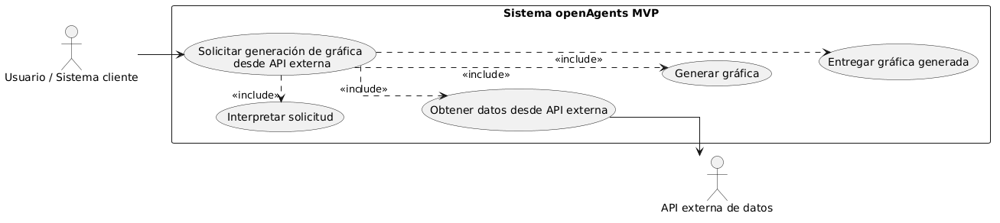
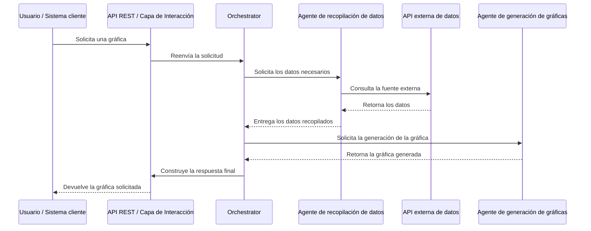

# ADR-003: Caso de uso del MVP - Generación de Gráficas desde API

**Estado**: Borrador

**Versión**: 0.1

**Fecha**: 2026-03-23

**Relacionado con**: [ADR-002 — Stack Tecnológico del MVP](002-stack-tecnologico-mvp.md)

# TO-DO
- rendimiento esperado ??
- frecuencia de uso ??
- especificar los LLMS y los contratos del sistema multiagente

## 1. Descripción del caso de uso

En el MVP de openAgents, uno de los casos de uso principales consiste en la generación de una representación gráfica a partir de datos obtenidos dinámicamente desde una API externa accesible mediante OpenAPI.

Este caso de uso valida el funcionamiento end-to-end del sistema multiagente, incluyendo:
- la recepción de solicitudes mediante API REST,
- la interpretación de la intención del usuario,
- la orquestación de agentes especializados,
- la obtención de datos estructurados desde fuentes externas,
- y la transformación de dichos datos en una visualización gráfica.

El flujo comienza cuando un usuario o sistema cliente envía una petición a la API REST del sistema especificando la necesidad de generar una gráfica. Esta petición puede incluir parámetros como:
- tipo de métrica o variable a consultar,
- rango temporal,
- tipo de gráfica (línea, barras, etc.),
- y filtros adicionales.

La capa de Interacción recibe la solicitud y la transmite al Orchestrator en la capa Core. El Orchestrator, apoyado por el modelo LLM, interpreta la petición, identifica los datos necesarios y planifica la ejecución del flujo.

A continuación, el Orchestrator invoca al agente de recopilación de datos, que actúa como cliente de APIs externas. Este agente construye la query correspondiente, realiza la llamada a la API OpenAPI y obtiene datos estructurados.

Una vez obtenidos los datos, el Orchestrator invoca al agente de generación de gráficas, proporcionando los datos junto con los parámetros de visualización. Este agente transforma los datos en una representación gráfica, generando un output en formato visual.

Finalmente, el Orchestrator construye una respuesta estructurada que contiene la gráfica generada y la devuelve al usuario a través de la API REST.

Este caso de uso tiene como objetivo validar la correcta integración entre componentes, asegurando que el sistema es capaz de:
- interpretar una solicitud de alto nivel,
- obtener datos desde fuentes externas,
- y generar automáticamente una visualización coherente.

Es importante destacar que, en este MVP, la generación de la gráfica es obligatoria: no se contemplan escenarios en los que únicamente se devuelvan datos sin visualización.

---

| UC-001 | Consulta de datos y generación de gráfica |
|---|---|
| Actores | - Usuario o sistema cliente - Orchestrator - Agente de recopilación de datos - Agente de generación de gráficas - API de datos (OpenAPI) |
| Precondiciones | - El sistema MVP está desplegado y accesible por API REST - La API externa de datos está disponible - El Orchestrator y los agentes están operativos - Existe conectividad con la fuente de datos |
| Postcondiciones | En caso de éxito: - Se obtienen los datos necesarios desde la API externa - Se genera la gráfica correspondiente según la solicitud - El sistema devuelve la gráfica en un formato estructurado (ej. imagen o JSON con referencia)  En caso de error: - Se devuelve un mensaje de error controlado - Se informa de la causa principal |
| Rendimiento | **El sistema deberá responder a la solicitud en un tiempo razonable (ej. < X segundos)** |
| Frecuencia | **Este caso de uso se espera que se lleve a cabo una media de X solicitudes por día** | 

---

### 2. Secuencia Normal

| # | Acción (actor) | Reacción (sistema) |
|---|--------------|-------------------|
| 1 | El usuario envía una petición de generación de gráfica a través de la API REST | El sistema recibe la solicitud en la capa de Interacción |
| 2 | La capa de Interacción transmite la solicitud al Orchestrator | El Orchestrator recibe la petición en la capa Core |
| 3 | El Orchestrator analiza la intención de la petición | El sistema identifica que se requiere generación de gráfica basada en datos externos |
| 4 | El Orchestrator decide obtener los datos necesarios | Invoca al agente de recopilación de datos |
| 5 | El agente de recopilación de datos solicita información a la API externa | La API externa recibe la solicitud |
| 6 | La API externa procesa la petición | Devuelve los datos al agente de recopilación |
| 7 | El agente de recopilación de datos procesa la respuesta | Devuelve los datos al Orchestrator |
| 8 | El Orchestrator solicita la generación de la gráfica | Invoca al agente de generación de gráficas |
| 9 | El agente de generación de gráficas recibe los datos | Genera la gráfica |
| 10 | El agente de generación de gráficas devuelve la gráfica | El Orchestrator recibe la visualización |
| 11 | El Orchestrator construye la respuesta final | Incluye la gráfica generada |
| 12 | El sistema envía la respuesta al usuario | El usuario recibe la gráfica |

--- 

### 3. Excepciones

| # | Acción (actor) | Reacción (sistema) |
|---|--------------|-------------------|
| E1 | En el caso de que el agente de recopilación de datos no pueda obtener la información | El sistema deberá devolver un mensaje de error y finalizar el caso de uso |
| E2 | En el caso de que la API externa no responda o devuelva un error | El sistema deberá gestionar el fallo y devolver un error controlado informando del problema con la fuente de datos |
| E3 | En el caso de que se produzca un error durante la generación de la gráfica | El sistema deberá devolver un mensaje de error, ya que la gráfica es obligatoria en este caso de uso |
| E4 | En el caso de que el usuario envíe una petición ambigua o incompleta | El sistema deberá solicitar aclaración o devolver un error de interpretación |

## 4. Diagrama del caso de uso

### 4.1. Diagrama UML de caso de uso

### 4.2. Diagrama de secuencia

## 5. Reglas y restricciones del MVP
- El acceso al sistema se realiza exclusivamente mediante API REST
- El Orchestrator es el único responsable de la coordinación
- Los agentes no interactúan directamente con el usuario
- La obtención de datos se limita a fuentes accesibles mediante OpenAPI
- Las gráficas son simples y orientadas a validación funcional
- No se incluye análisis avanzado ni personalización compleja

## 6. Relación con la arquitectura del MVP
### Capas implicadas
- **Capa de Interacción**
    - Recepción de la petición REST
    - Envío de la respuesta

- **Capa de Desarrollo**
    - Definición de agentes, tools y flujos

- **Capa Core**
    - Ejecución del Orchestrator
    - Ejecución de agentes especializados

- **Capa Fundación**
    - Uso del modelo LLM para interpretar la petición y coordinar el flujo

### Agentes implicados

- **Orchestrator**: planificación y coordinación
- **Agente de datos**: consulta de APIs externas
- **Agente de gráficas**: generación de visualizaciones

## 7. Especificación de contratos de cada agente

### Agente de recopilación de datos
- **Input**: recibe un prompt del Orchestrator con los parámetros de consulta (métrica, rango, filtros)
- **Output**: devuelve datos estructurados obtenidos de la API junto con metadatos básicos (endpoint usado, parámetros aplicados, estado)
- **Modelo LLM**: modelo ligero vía OpenRouter para interpretar el prompt y mapearlo a una llamada a la API
- **Capacidades**:
  - interpretar intención simple (qué datos se necesitan)
  - seleccionar el endpoint adecuado de la API (basado en OpenAPI)
  - construir la request (path, query params, headers)
  - ejecutar la llamada HTTP
  - transformar la respuesta a formato uniforme
- **Herramientas (Tools)**:
  - cliente HTTP (GET requests)
  - acceso a especificación OpenAPI
  - parser/validador de parámetros
- **Contrato de entrada**:
  - prompt corto y estructurado 
  - debe incluir al menos una métrica o tipo de dato
  - puede incluir rango temporal y filtros opcionales
- **Contrato de salida**:
  - status: success | error
  - data: datos obtenidos (array / JSON)
  - metadata: endpoint, parámetros, timestamp
  - error: mensaje en caso de fallo

## 8. Criterio de aceptación
Este caso de uso se considera completado cuando:

- El sistema recibe correctamente la petición por API REST
- El Orchestrator coordina el flujo entre agentes
- Se obtienen datos desde una API externa
- Se genera una gráfica a partir de esos datos
- El usuario recibe una respuesta coherente y estructurada
