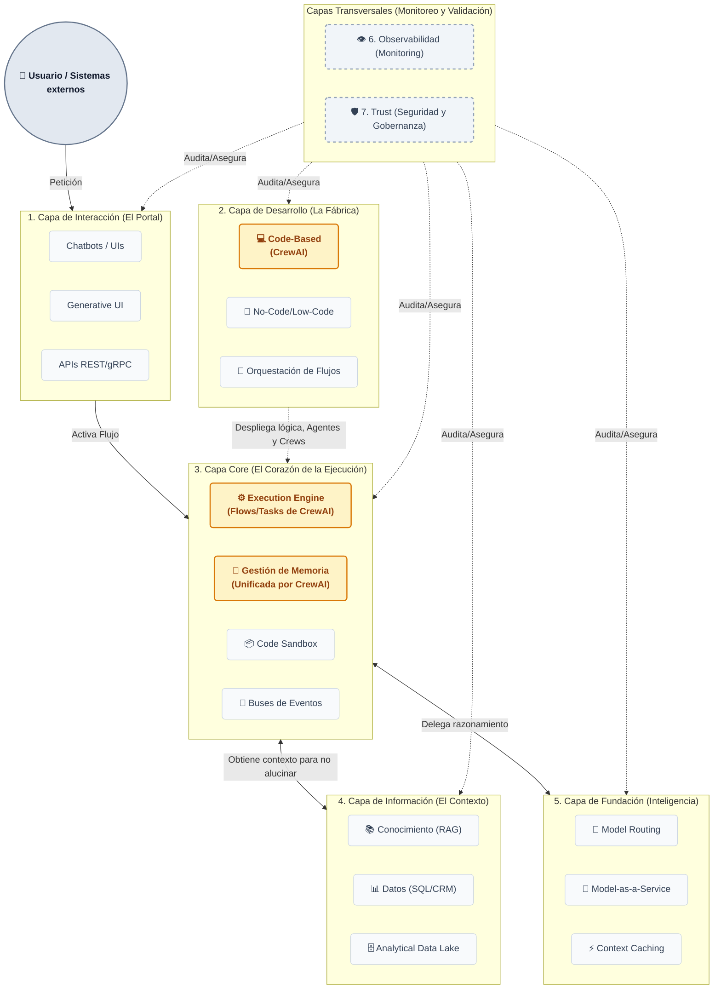

# Arquitectura PaaS de Agentes IA

Diagrama de bloques de los 7 contenedores lógicos que transforman el razonamiento de los LLMs en acciones empresariales, con un enfoque especial en el framework **CrewAI**.

## Diagrama de Bloques Funcional

## Flujo Funcional Simplificado
1. **Usuario envía petición por Interacción.**
2. **El Core activa el flujo diseñado en Desarrollo.**
3. **Agente consulta Información y pide razonamiento a Fundación.**
4. **Todo se valida por Trust y Observabilidad.**

*Nota: Para el detalle completo de las capas, revisa el archivo original.*