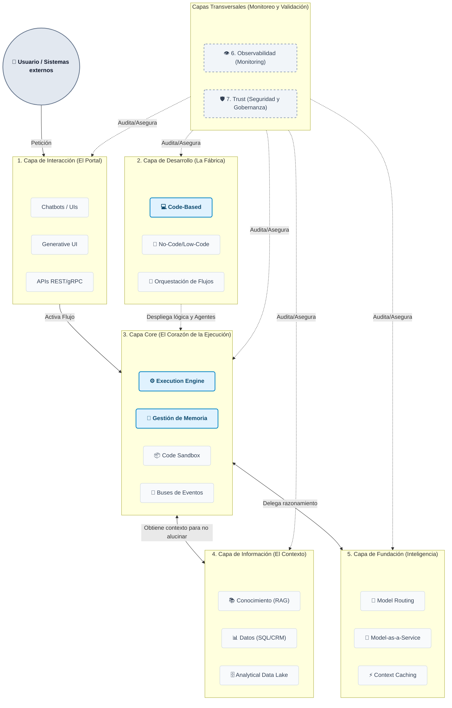
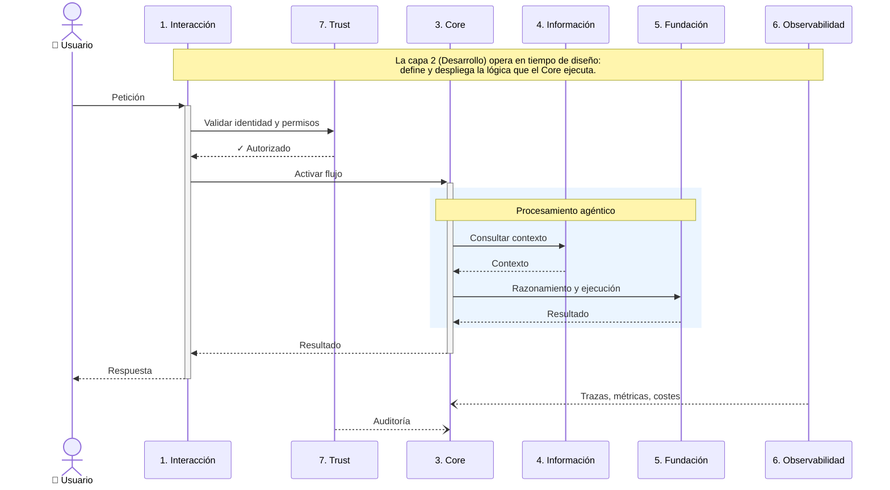

# Arquitectura PaaS de Agentes IA

## Qué es openAgents

openAgents es una plataforma (PaaS) para construir, desplegar y operar agentes IA en contexto empresarial. Su objetivo es cerrar la brecha entre el razonamiento de los LLMs y las acciones reales de negocio: que un agente no solo "piense", sino que ejecute, recuerde, se coordine con otros agentes, y lo haga de forma segura y auditable.

## Para quién

La plataforma sirve a cuatro perfiles:

- **Desarrolladores**: Crean agentes y flujos en código, definen herramientas y skills, y despliegan a producción.
- **Integradores**: Construyen flujos mediante interfaces visuales (No-Code/Low-Code) sin escribir código.
- **Usuarios finales**: Interactúan con los agentes a través de chatbots, UIs, APIs o canales como Slack, email o voz.
- **Operaciones (Ops/Security)**: Monitorizan el comportamiento de los agentes, gestionan costes, y gobiernan permisos y políticas de seguridad.

## Organización: 7 capas

La plataforma se organiza en 7 contenedores lógicos. Las capas 1-5 forman el flujo principal (desde la petición del usuario hasta la respuesta). Las capas 6 y 7 son transversales: envuelven a todas las demás para garantizar visibilidad y control.

- **1. Interacción (El Portal)**: Punto de entrada para usuarios humanos y sistemas externos. Incluye chatbots, UIs personalizadas, Generative UI (interfaces creadas dinámicamente según la intención) y APIs REST/gRPC para integración máquina a máquina. También cubre canales como Slack, email o voz.
- **2. Desarrollo (La Fábrica)**: Donde se diseñan y construyen los agentes y sus flujos de trabajo. Ofrece tres caminos: desarrollo en código (versionado con Git, CI/CD, despliegue a producción), estudios visuales drag-and-drop para integradores (No-Code/Low-Code), y orquestación declarativa del esqueleto lógico de los flujos.
- **3. Core (El Corazón)**: Motor en tiempo de ejecución. El Execution Engine gestiona el ciclo cognitivo de los agentes — enrutamiento, lógica condicional, checkpointing y persistencia de estado. La Gestión de Memoria cubre memoria de corto plazo (estado de tarea), largo plazo (conocimiento persistente) y enriquecimiento de contexto. Code Sandbox aísla la ejecución de código en contenedores seguros. Los Buses de Eventos habilitan activación asíncrona.
- **4. Información (El Contexto)**: Provee los datos que evitan alucinaciones y conectan con la realidad. Conocimiento indexado vía RAG (documentos, manuales, búsqueda semántica), datos operacionales (SQL/CRM) para ejecutar acciones reales, y un data lake analítico para datos históricos complejos.
- **5. Fundación (Inteligencia)**: Suministra la capacidad de razonamiento. Model Routing despacha peticiones según complejidad (coste vs. capacidad), Model-as-a-Service abstrae el acceso multi-proveedor (OpenAI, Anthropic, Google), y Context Caching reduce consumo de tokens.
- **6. Observabilidad**: Trazas de ejecución, auditorías, métricas de precisión y FinOps (control de costes).
- **7. Trust (Seguridad y Gobernanza)**: Identidad y permisos (IAM/RBAC), guardrails de entrada/salida contra inyecciones, y un registry de agentes y herramientas autorizados.

## Flujo funcional

## Documentación detallada

Cada capa tiene su propio documento con componentes, interfaces, decisiones técnicas y alcance del MVP:

| Capa | Documento |
|------|-----------|
| 1. Interacción | [01-interaction.md](layers/01-interaction.md) |
| 2. Desarrollo | [02-development.md](layers/02-development.md) |
| 3. Core | [03-core.md](layers/03-core.md) |
| 4. Información | [04-information.md](layers/04-information.md) |
| 5. Fundación | [05-foundation.md](layers/05-foundation.md) |
| 6. Observabilidad | [06-observability.md](layers/06-observability.md) |
| 7. Trust | [07-trust.md](layers/07-trust.md) |

Las decisiones arquitectónicas se registran en [docs/adr/](adr/).
