# Arquitectura PaaS de Agentes IA

Diagrama de bloques de los 7 contenedores lógicos que transforman el razonamiento de los LLMs en acciones empresariales, con un enfoque especial en el framework **CrewAI**.

## Diagrama de Bloques Funcional

```mermaid
flowchart TD
    classDef default fill:#f8fafc,stroke:#cbd5e1,stroke-width:1px,color:#334155,rx:5px,ry:5px;
    classDef user fill:#e2e8f0,stroke:#64748b,stroke-width:2px,color:#0f172a,font-weight:bold;
    classDef crewai fill:#fef3c7,stroke:#d97706,stroke-width:2px,color:#92400e,font-weight:bold;
    classDef transversales fill:#f1f5f9,stroke:#94a3b8,stroke-width:2px,stroke-dasharray: 5 5;
    classDef spacer fill:transparent,stroke:transparent,color:transparent;

    Usuario((👥 Usuario / Sistemas externos)):::user

    subgraph L1 ["1. Capa de Interacción (El Portal)"]
        direction LR
        _sp1["　　　　　　　　　　　　　　　　　　　　　　　"]:::spacer
        UI[Chatbots / UIs]
        GenUI[Generative UI]
        API[APIs REST/gRPC]
    end

    subgraph L2 ["2. Capa de Desarrollo (La Fábrica)"]
        direction LR
        _sp2["　　　　　　　　　　　　　　　　　　　　　　　"]:::spacer
        CodeDev["💻 Code-Based<br/>(CrewAI)"]:::crewai
        NoCode["🧩 No-Code/Low-Code"]
        FlowOrch["🔀 Orquestación de Flujos"]
    end

    subgraph L3 ["3. Capa Core (El Corazón de la Ejecución)"]
        direction LR
        _sp3["　　　　　　　　　　　　　　　　　　　　　　　　　　　　　"]:::spacer
        ExecEngine["⚙️ Execution Engine<br/>(Flows/Tasks de CrewAI)"]:::crewai
        Memoria["🧠 Gestión de Memoria<br/>(Unificada por CrewAI)"]:::crewai
        Sandbox["📦 Code Sandbox"]
        EventBus["📨 Buses de Eventos"]
    end

    subgraph L4 ["4. Capa de Información (El Contexto)"]
        direction LR
        _sp4["　　　　　　　　　　　　　　　　　　　　　　　"]:::spacer
        RAG["📚 Conocimiento (RAG)"]
        OpsData["📊 Datos (SQL/CRM)"]
        DataLake["🗄️ Analytical Data Lake"]
    end

    subgraph L5 ["5. Capa de Fundación (Inteligencia)"]
        direction LR
        _sp5["　　　　　　　　　　　　　　　　　　　　　　　"]:::spacer
        Router["🚦 Model Routing"]
        MaaS["🧠 Model-as-a-Service"]
        Cache["⚡ Context Caching"]
    end

    subgraph Transversales ["Capas Transversales (Monitoreo y Validación)"]
        direction LR
        _sp6["　　　　　　　　　　　　　　　　　　　　　　　　　　　　　"]:::spacer
        Obs["👁️ 6. Observabilidad (Monitoring)"]:::transversales
        Trust["🛡️ 7. Trust (Seguridad y Gobernanza)"]:::transversales
    end

    Usuario -->|Petición| L1
    L1 -->|Activa Flujo| L3
    L2 -.->|Despliega lógica, Agentes y Crews| L3
    L3 <-->|Obtiene contexto para no alucinar| L4
    L3 <-->|Delega razonamiento| L5
    Transversales -.->|Audita/Asegura| L1
    Transversales -.->|Audita/Asegura| L2
    Transversales -.->|Audita/Asegura| L3
    Transversales -.->|Audita/Asegura| L4
    Transversales -.->|Audita/Asegura| L5
```

## Flujo Funcional Simplificado
1. **Usuario envía petición por Interacción.**
2. **El Core activa el flujo diseñado en Desarrollo.**
3. **Agente consulta Información y pide razonamiento a Fundación.**
4. **Todo se valida por Trust y Observabilidad.**

*Nota: Para el detalle completo de las capas, revisa el archivo original.*