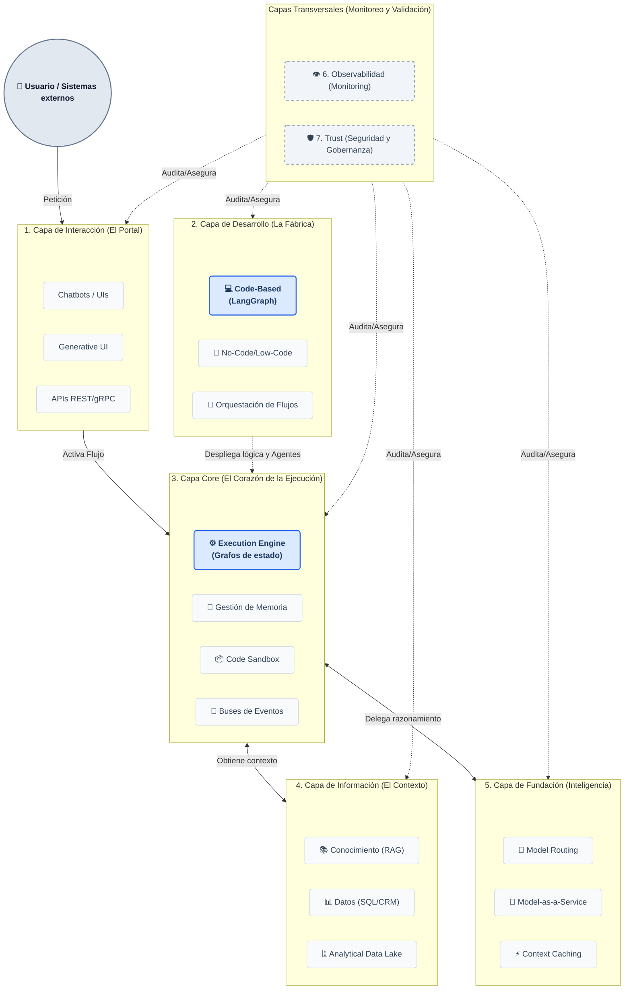

# Arquitectura PaaS de Agentes IA

openAgents es una plataforma (PaaS) que permite construir, desplegar y operar agentes IA en contexto empresarial. Su objetivo es que los agentes no solo razonen, sino que ejecuten acciones reales, recuerden contexto, se coordinen entre sí, y lo hagan de forma segura y auditable.

La plataforma está pensada para cuatro perfiles: desarrolladores que crean agentes en código, integradores que construyen flujos de forma visual (No-Code), usuarios finales que interactúan con los agentes (chat, APIs, voz), y equipos de operaciones que monitorizan, gobiernan y controlan costes.

## Diagrama de bloques

La arquitectura se organiza en 7 contenedores lógicos. Las capas 1 a 5 forman el flujo principal — desde la petición del usuario hasta la respuesta del agente. Las capas 6 y 7 son transversales: envuelven a todas las demás para garantizar visibilidad y control.

## Flujo funcional

1. El **usuario** envía una petición a través de la capa de **Interacción**.
2. El **Core** activa el flujo diseñado en **Desarrollo** — los agentes razonan, ejecutan herramientas y se coordinan.
3. Los agentes consultan **Información** para contexto y **Fundación** para razonamiento LLM.
4. **Observabilidad** y **Trust** auditan y aseguran cada paso del proceso.

## Documentación detallada

El detalle de cada capa (componentes, interfaces, decisiones técnicas, alcance MVP) vive en [docs/layers/](layers/). Las decisiones arquitectónicas se registran en [docs/adr/](adr/).
