# Arquitectura PaaS de Agentes IA

openAgents es una plataforma (PaaS) que permite construir, desplegar y operar agentes IA en contexto empresarial. Su objetivo es que los agentes no solo razonen, sino que ejecuten acciones reales, recuerden contexto, se coordinen entre sí, y lo hagan de forma segura y auditable.

La plataforma está pensada para cuatro perfiles: desarrolladores que crean agentes en código, integradores que construyen flujos de forma visual (No-Code), usuarios finales que interactúan con los agentes (chat, APIs, voz), y equipos de operaciones que monitorizan, gobiernan y controlan costes.

## Diagrama de bloques

La arquitectura se organiza en 7 contenedores lógicos. Las capas 1 a 5 forman el flujo principal — desde la petición del usuario hasta la respuesta del agente. Las capas 6 y 7 son transversales: envuelven a todas las demás para garantizar visibilidad y control.

```mermaid
flowchart TD
    classDef default fill:#f8fafc,stroke:#cbd5e1,stroke-width:1px,color:#334155,rx:5px,ry:5px;
    classDef user fill:#e2e8f0,stroke:#64748b,stroke-width:2px,color:#0f172a,font-weight:bold;
    classDef framework fill:#dbeafe,stroke:#2563eb,stroke-width:2px,color:#1e3a5f,font-weight:bold;
    classDef transversales fill:#f1f5f9,stroke:#94a3b8,stroke-width:2px,stroke-dasharray: 5 5;
    classDef spacer fill:transparent,stroke:transparent,color:transparent;

    Usuario((👥 Usuario / Sistemas externos)):::user

    subgraph L1 ["1. Capa de Interacción (El Portal)"]
        direction LR
        _sp1["　　　　　　　　　　　　　　　　　　　　　　　"]:::spacer
        UI[Chatbots / UIs]
        GenUI[Generative UI]
        API[APIs REST/gRPC]
    end

    subgraph L2 ["2. Capa de Desarrollo (La Fábrica)"]
        direction LR
        _sp2["　　　　　　　　　　　　　　　　　　　　　　　"]:::spacer
        CodeDev["💻 Code-Based<br/>(LangGraph)"]:::framework
        NoCode["🧩 No-Code/Low-Code"]
        FlowOrch["🔀 Orquestación de Flujos"]
    end

    subgraph L3 ["3. Capa Core (El Corazón de la Ejecución)"]
        direction LR
        _sp3["　　　　　　　　　　　　　　　　　　　　　　　　　　　　　"]:::spacer
        ExecEngine["⚙️ Execution Engine<br/>(Grafos de estado)"]:::framework
        Memoria["🧠 Gestión de Memoria"]
        Sandbox["📦 Code Sandbox"]
        EventBus["📨 Buses de Eventos"]
    end

    subgraph L4 ["4. Capa de Información (El Contexto)"]
        direction LR
        _sp4["　　　　　　　　　　　　　　　　　　　　　　　"]:::spacer
        RAG["📚 Conocimiento (RAG)"]
        OpsData["📊 Datos (SQL/CRM)"]
        DataLake["🗄️ Analytical Data Lake"]
    end

    subgraph L5 ["5. Capa de Fundación (Inteligencia)"]
        direction LR
        _sp5["　　　　　　　　　　　　　　　　　　　　　　　"]:::spacer
        Router["🚦 Model Routing"]
        MaaS["🧠 Model-as-a-Service"]
        Cache["⚡ Context Caching"]
    end

    subgraph Transversales ["Capas Transversales (Monitoreo y Validación)"]
        direction LR
        _sp6["　　　　　　　　　　　　　　　　　　　　　　　　　　　　　"]:::spacer
        Obs["👁️ 6. Observabilidad (Monitoring)"]:::transversales
        Trust["🛡️ 7. Trust (Seguridad y Gobernanza)"]:::transversales
    end

    Usuario -->|Petición| L1
    L1 -->|Activa Flujo| L3
    L2 -.->|Despliega lógica y Agentes| L3
    L3 <-->|Obtiene contexto| L4
    L3 <-->|Delega razonamiento| L5
    Transversales -.->|Audita/Asegura| L1
    Transversales -.->|Audita/Asegura| L2
    Transversales -.->|Audita/Asegura| L3
    Transversales -.->|Audita/Asegura| L4
    Transversales -.->|Audita/Asegura| L5
```

## Flujo funcional

1. El **usuario** envía una petición a través de la capa de **Interacción**.
2. El **Core** activa el flujo diseñado en **Desarrollo** — los agentes razonan, ejecutan herramientas y se coordinan.
3. Los agentes consultan **Información** para contexto y **Fundación** para razonamiento LLM.
4. **Observabilidad** y **Trust** auditan y aseguran cada paso del proceso.

## Documentación detallada

El detalle de cada capa (componentes, interfaces, decisiones técnicas, alcance MVP) vive en [docs/layers/](layers/). Las decisiones arquitectónicas se registran en [docs/adr/](adr/).
