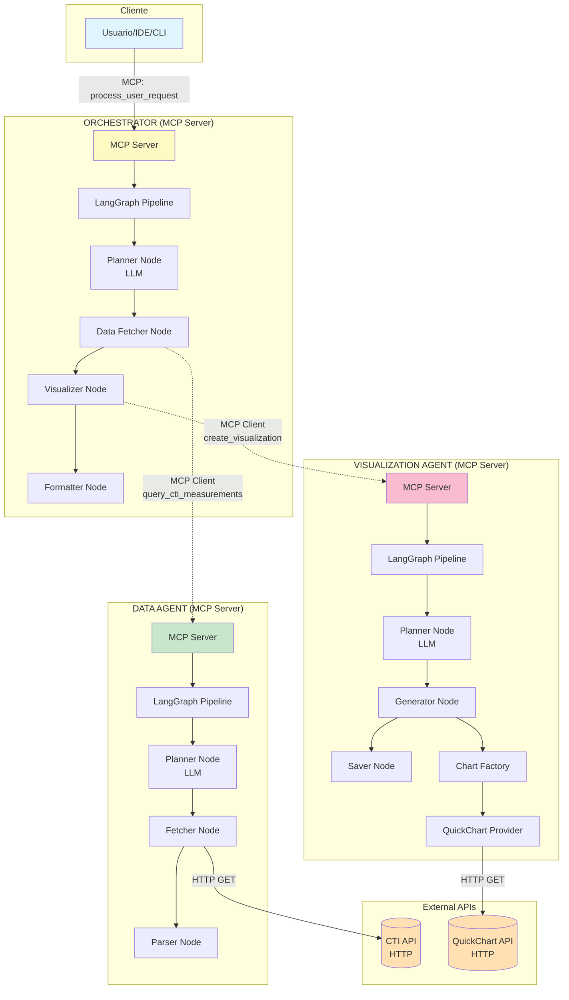
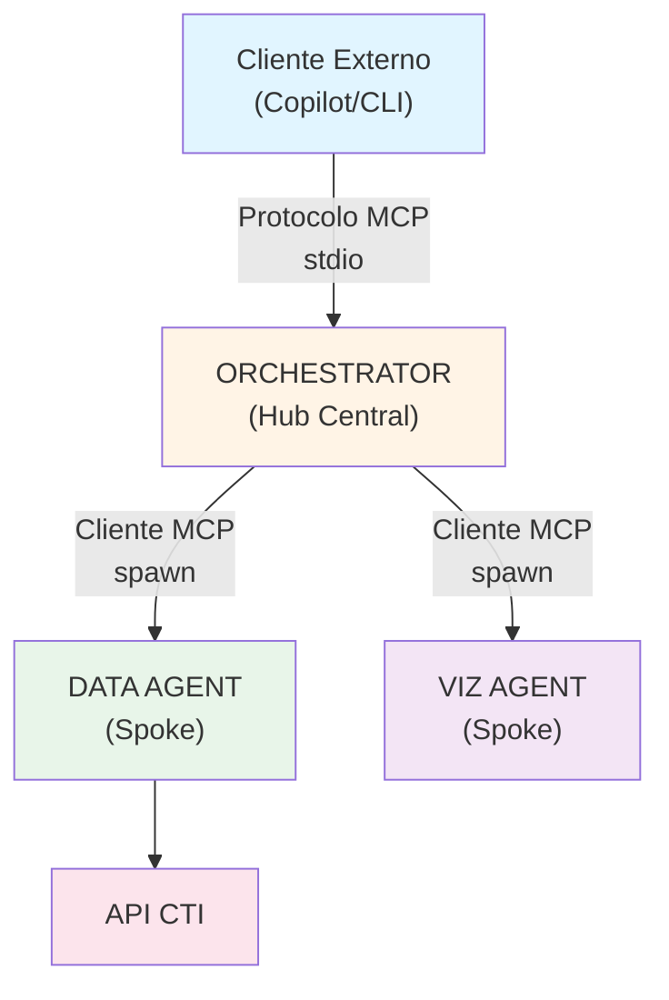
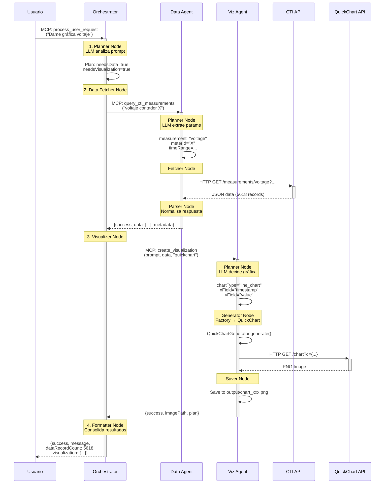
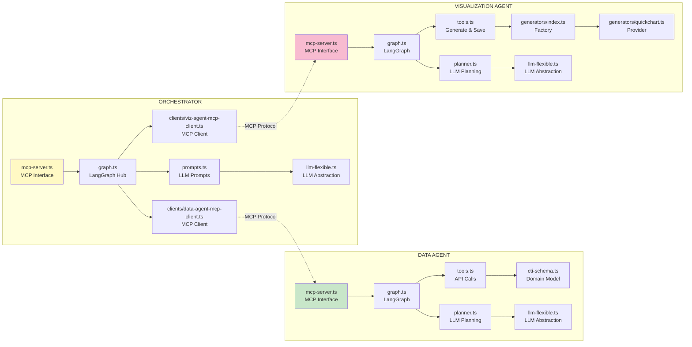
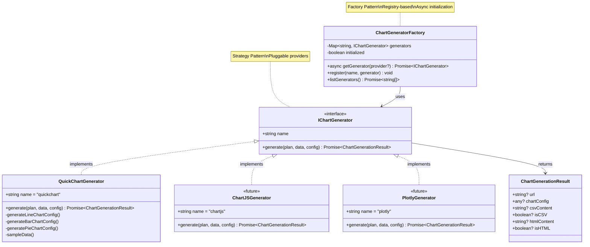
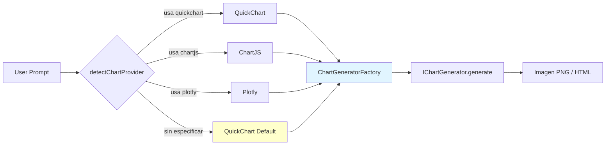
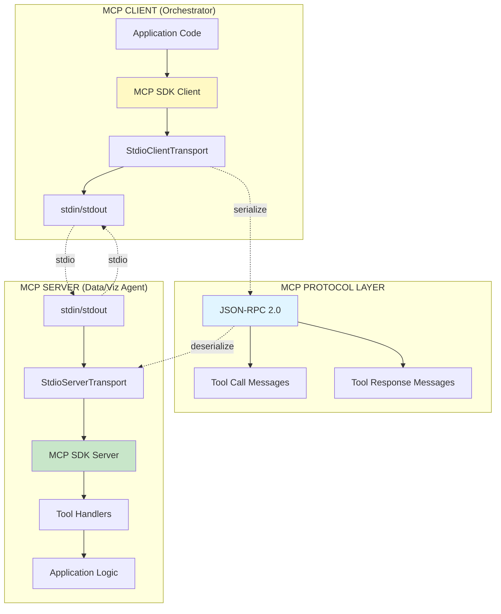
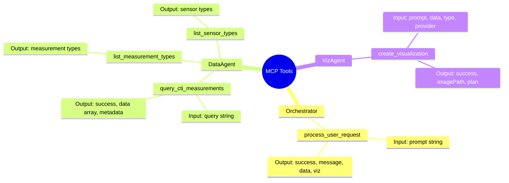
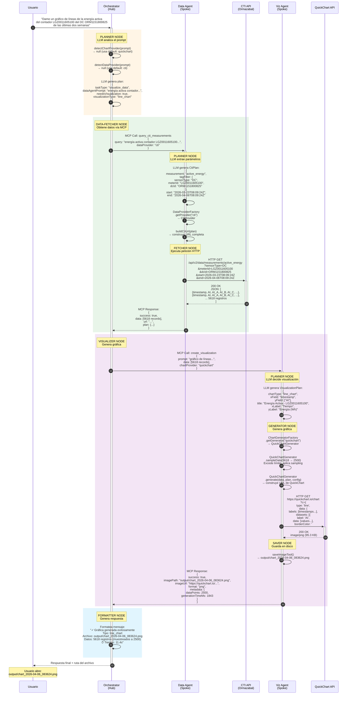

# OpenAgents - Módulo Core

**Fecha**: 2026-04-06
**Versión**: 1.0.0

Sistema modular basado en agentes para consultar datos de mediciones eléctricas y generar visualizaciones utilizando una arquitectura hub-and-spoke.

## Índice

1. [Descripción General](#descripción-general)
2. [Arquitectura](#arquitectura)
  2.1. [Patrón Hub-and-Spoke](#patrón-hub-and-spoke)
  2.2. [Agentes del Sistema](#agentes-del-sistema)
  2.3. [Flujo de Comunicación](#flujo-de-comunicación)
  2.4. [Estructura de Componentes por Agente](#estructura-de-componentes-por-agente)
3. [Patrones de Diseño Implementados](#patrones-de-diseño-implementados)
  3.1. [Strategy Pattern - Chart Providers](#strategy-pattern---chart-providers)
4. [Model Context Protocol (MCP)](#model-context-protocol-mcp)
5. [Instalación Rápida](#instalación-rápida)
6. [Configuración](#configuración)
7. [Uso](#uso)
8. [Estructura del Proyecto](#estructura-del-proyecto)
9. [Ejemplo de Caso Real](#ejemplo-de-caso-real)


---

## 1. Descripción General

OpenAgents Core implementa un sistema distribuido donde **agentes especializados se coordinan a través del Model Context Protocol (MCP)** para entregar capacidades inteligentes de procesamiento de datos y visualización.

El sistema OpenAgents es una arquitectura multi-agente donde cada agente:
- **Es un servidor MCP independiente** (Model Context Protocol)
- **Expone tools específicas** que pueden ser invocadas por otros agentes
- **Se comunica únicamente con el orchestrator** (patrón hub-and-spoke)
- **Usa LangGraph** para orquestar su flujo interno


---

## 2. Arquitectura

### 2.1. Patrón Hub-and-Spoke

El sistema implementa una **arquitectura hub-and-spoke** donde el Orchestrator actúa como hub central, coordinando agentes especializados (spokes):



**Principios clave:**
1. **Comunicación Centralizada**: Los agentes especializados NUNCA se comunican directamente entre ellos
2. **Aislamiento de Agentes**: Cada agente opera de forma independiente
3. **Protocolo Estándar**: Toda comunicación usa MCP (JSON-RPC sobre stdio)
4. **Spawning Dinámico**: El orchestrator inicia agentes bajo demanda

### 2.2. Agentes del Sistema

#### Orchestrator (Hub Central)

**Rol**: Coordinar data-agent y visualization-agent para cumplir con requests del usuario.ç

**Responsabilidades**:
- Analizar y comprender solicitudes del usuario usando LLM
- Crear planes de ejecución multi-paso
- Coordinar agentes especializados vía MCP
- Agregar y presentar resultados al usuario

**Documentación completa**: [`orchestrator/03-core-orchestrator.md`](./orchestrator/03-core-orchestrator.md)

---

#### Data Agent (Spoke)

**Rol**: Especialista en obtención y procesamiento de datos.

**Responsabilidades**:
- Consultar API de mediciones eléctricas
- Filtrar y transformar datos según parámetros
- Validar y normalizar información
- Proporcionar datos estructurados al orchestrator

**Documentación completa**: [`data-agent/03-core-data-agent.md`](./data-agent/03-core-data-agent.md)

---

#### Visualization Agent (Spoke)

**Rol**: Especialista en generación de visualizaciones y análisis de datos

**Responsabilidades**:
- Analizar datos y prompts con LLM para decidir tipo de visualización óptima
- Generar gráficas usando **proveedores intercambiables** vía Strategy Pattern
  - QuickChart (por defecto): line, bar, pie, scatter, radar, area, histogram, heatmap
  - Extensible a ChartJS, Plotly, etc.
- Crear tablas exportadas a CSV
- Generar HTML interactivo para visualizaciones complejas (heatmaps grandes)
- Pipeline basado en LangGraph con 3 etapas: Planner → Generator → Saver

**Arquitectura**:
- **Planner Node**: Usa LLM para generar plan de visualización
- **Generator Node**: Usa ChartGeneratorFactory para obtener proveedor adecuado (QuickChart, etc.)
- **Saver Node**: Persiste resultado en disco (PNG/CSV/HTML)
- **Strategy Pattern**: Providers implementan IChartGenerator interface

**Tipos de visualización soportados**: 9 tipos - line_chart, bar_chart, pie_chart, scatter, table, area_chart, radar, histogram, heatmap

**Chart Providers**:
- QuickChart - API externa para gráficas simples

**Documentación completa**: [`visualization-agent/03-core-viz-agent.md`](./visualization-agent/03-core-viz-agent.md)

---

### 2.3. Flujo de Comunicación

**Secuencia típica de operación:**



---


## 2.4. Estructura de Componentes por Agente



---

## 3. Patrones de Diseño Implementados

### 3.1. Strategy Pattern - Chart Providers

El Visualization Agent implementa el **patrón Strategy** para desacoplar la generación de gráficas de la implementación específica de cada proveedor.

**Componentes clave:**

```typescript
// Interface común para todos los proveedores
interface IChartGenerator {
  generate(data: any[], plan: VisualizationPlan, config: ChartConfig): Promise<string>;
  validateData(data: any[]): boolean;
  getMaxDataPoints(): number;
  getName(): string;
  sampleData(data: any[], maxPoints: number): any[];
}

// Factory que selecciona el proveedor apropiado
class ChartGeneratorFactory {
  private static generators = new Map<string, IChartGenerator>();
  
  static async initialize() { /* carga dinámica de providers */ }
  static async getGenerator(provider: string): Promise<IChartGenerator> { /* ... */ }
  static registerGenerator(name: string, generator: IChartGenerator) { /* ... */ }
}
```

**Patrón Strategy - Chart Generator Factory**




**Flujo de selección de proveedor:**



**Detección automática:**
- El orchestrator analiza el prompt del usuario
- Si contiene "quickchart", "chartjs", "plotly" → usa ese proveedor
- Si no se especifica → usa QuickChart por defecto

**Providers actuales:**
- **QuickChart**: API externa, rápido, límite de 2500 puntos por URL

---

## 4. Model Context Protocol (MCP)

MCP es el protocolo estándar que permite la comunicación entre el orchestrator y los agentes especializados.

### Conceptos Clave

**¿Qué es MCP?**
- Protocolo JSON-RPC 2.0 para comunicación entre LLMs y herramientas
- Transporte sobre stdio (entrada/salida estándar)
- Permite descubrimiento dinámico de capacidades

**Componentes principales:**

```typescript
// Servidor MCP (Data Agent, Viz Agent)
interface MCPServer {
  tools: Tool[];          // Herramientas disponibles
  resources?: Resource[]; // Recursos opcionales
  prompts?: Prompt[];     // Prompts opcionales
}

// Cliente MCP (Orchestrator)
interface MCPClient {
  connect(): Promise<void>;
  listTools(): Promise<Tool[]>;
  callTool(name: string, args: any): Promise<any>;
  close(): Promise<void>;
}
```

**Ejemplo de mensaje MCP:**

```json
{
  "jsonrpc": "2.0",
  "id": 1,
  "method": "tools/call",
  "params": {
    "name": "fetchData",
    "arguments": {
      "endpoint": "/carga",
      "startDate": "2024-01-01",
      "endDate": "2024-01-31"
    }
  }
}
```

### MCP Protocol Stack



### Resumen de Tools MCP



**Más información**: [Documentación oficial MCP](https://modelcontextprotocol.io/)

---

## 5. Instalación Rápida

### Requisitos Previos

- **Node.js**: >= 18.0.0
- **npm**: >= 9.0.0
- **Proveedor LLM**: GitHub Copilot o OpenRouter con API key

### Instalación

```bash
# Clonar repositorio
git clone <repository-url>
cd openAgents/packages/core

# Instalar dependencias en todos los agentes
npm install
cd orchestrator && npm install && cd ..
cd data-agent && npm install && cd ..
cd visualization-agent && npm install && cd ..

# Compilar todos los agentes
npm run build
```

### Verificación

```bash
# Verificar cada agente individualmente
node orchestrator/dist/index.js
node data-agent/dist/index.js
node visualization-agent/dist/index.js
```

**Instalación detallada por agente**:
- [`orchestrator/03-core-orchestrator.md`](./orchestrator/03-core-orchestrator.md#instalación)
- [`data-agent/03-core-data-agent.md`](./data-agent/03-core-data-agent.md#instalación)
- [`visualization-agent/03-core-viz-agent.md`](./visualization-agent/03-core-viz-agent.md#instalación)

---

## 6. Configuración

### Variables de Entorno Globales

**Configuración compartida por todos los agentes:**

```bash
# .env (en cada carpeta de agente)

# Proveedor LLM (obligatorio)
LLM_PROVIDER=copilot  # o "openrouter"

# GitHub Copilot (si LLM_PROVIDER=copilot)
# No requiere API key adicional - usa autenticación de GitHub CLI

# OpenRouter (si LLM_PROVIDER=openrouter)
OPENROUTER_API_KEY=sk-or-v1-xxxxx
OPENROUTER_MODEL=anthropic/claude-3.5-sonnet  # opcional
```

### Configuración Específica por Agente

Cada agente tiene variables adicionales específicas:

| Agente | Variables Específicas | Documentación |
|--------|----------------------|---------------|
| **Orchestrator** | `DATA_AGENT_PATH`, `VIZ_AGENT_PATH` | [Ver detalles →](./orchestrator/03-core-orchestrator.md#configuración) |
| **Data Agent** | `CTI_BASE_URL`, `CTI_AUTH_HEADER` | [Ver detalles →](./data-agent/03-core-data-agent.md#configuración) |
| **Visualization Agent** | Ninguna adicional requerida | [Ver detalles →](./visualization-agent/03-core-viz-agent.md#configuración) |


---

## 7. Uso

### 1. Modo Servidor MCP (Recomendado)

**Uso con GitHub Copilot CLI:**

```json
// En tu configuración de GitHub Copilot
{
  "mcpServers": {
    "openagents": {
      "command": "node",
      "args": ["packages/core/orchestrator/dist/index.js"],
      "env": {
        "LLM_PROVIDER": "copilot"
      }
    }
  }
}
```

**Interacción:**
```bash
# El orchestrator se ejecuta como servidor MCP
# GitHub Copilot CLI se comunica automáticamente via stdio
```

### 2. Modo Interactivo (Desarrollo/Testing)

```bash
cd orchestrator
node dist/index.js

# Escribe tu solicitud:
> "Muestra la carga eléctrica de enero 2024 en un gráfico de líneas"
```

### 3. Uso como Módulo (Integración)

```typescript
import { Orchestrator } from './orchestrator';

const orchestrator = new Orchestrator();
await orchestrator.initialize();

const result = await orchestrator.processRequest(
  "Visualiza consumo eléctrico del último mes"
);
console.log(result);
```

---

## 8. Estructura del Proyecto

```
packages/core/
├── orchestrator/              # Hub central
│   ├── src/
│   │   ├── index.ts          # Entry point + MCP server
│   │   ├── graph.ts          # LangGraph orchestration flow
│   │   ├── clients/          # Clientes MCP para agentes
│   │   │   ├── data-agent-mcp-client.ts
│   │   │   └── viz-agent-mcp-client.ts
│   │   ├── llm/              # Capa de abstracción LLM
│   │   │   ├── copilot.ts
│   │   │   └── openrouter.ts
│   │   └── types.ts          # Tipos e interfaces
│   ├── dist/                 # Código compilado
│   ├── package.json
│
├── data-agent/                # Spoke - Obtención de datos
│   ├── src/
│   │   ├── index.ts          # Entry point + MCP server
│   │   ├── graph.ts          # LangGraph data processing
│   │   ├── tools.ts          # Implementación fetchData
│   │   └── llm/              # Abstracción LLM
│   ├── dist/
│   ├── package.json
│
├── visualization-agent/       # Spoke - Generación de gráficos
│   ├── src/
│   │   ├── index.ts          # Entry point + MCP server
│   │   ├── graph.ts          # LangGraph pipeline (Planner→Generator→Saver)
│   │   ├── planner.ts        # LLM para decisión de visualización
│   │   ├── tools.ts          # Herramientas de generación y guardado
│   │   ├── generators/       # Chart providers (Strategy Pattern)
│   │   │   ├── index.ts      # Factory + IChartGenerator interface
│   │   │   └── quickchart.ts # QuickChart implementation
│   │   └── llm/              # Abstracción LLM (Copilot/OpenRouter)
│   ├── dist/
│   ├── package.json
```

---


## 9. Ejemplo de Caso Real

**Prompt de Usuario:**
```
Dame un gráfico de líneas de la energía activa del contador LGZ0011605100 del DC ORM1151800825 de las últimas dos semanas
```

**Flujo de Ejecución Completo:**



**Puntos Clave del Flujo:**

1. **Detección Automática de Providers** (pasos 2-3):
   - `detectChartProvider()` no encuentra keyword → usa default "quickchart"
   - `detectDataProvider()` no encuentra keyword → usa default "cti"

2. **Data Agent - Procesamiento Inteligente** (pasos 6-11):
   - LLM interpreta prompt en lenguaje natural
   - Extrae: measurement, sensorType, meterId, dcId, fechas
   - Factory selecciona CtiProvider
   - Construye URL estructurada para CTI API
   - Recibe 5618 registros de energía activa

3. **Viz Agent - Generación con Límites** (pasos 14-21):
   - LLM decide: line_chart (por "gráfico de líneas" en prompt)
   - Factory selecciona QuickChartGenerator
   - **Sampling automático**: 5618 → 2500 puntos (límite de QuickChart)
   - Genera URL, descarga PNG, guarda en disco

4. **Tiempo Total**: ~11.4 segundos
   - Data fetch: ~8.5s
   - Visualization: ~1.8s
   - Overhead (LLM, MCP): ~1.1s

5. **Formato de Salida**: PNG de 95.3 KB con 2500 puntos de datos

---
