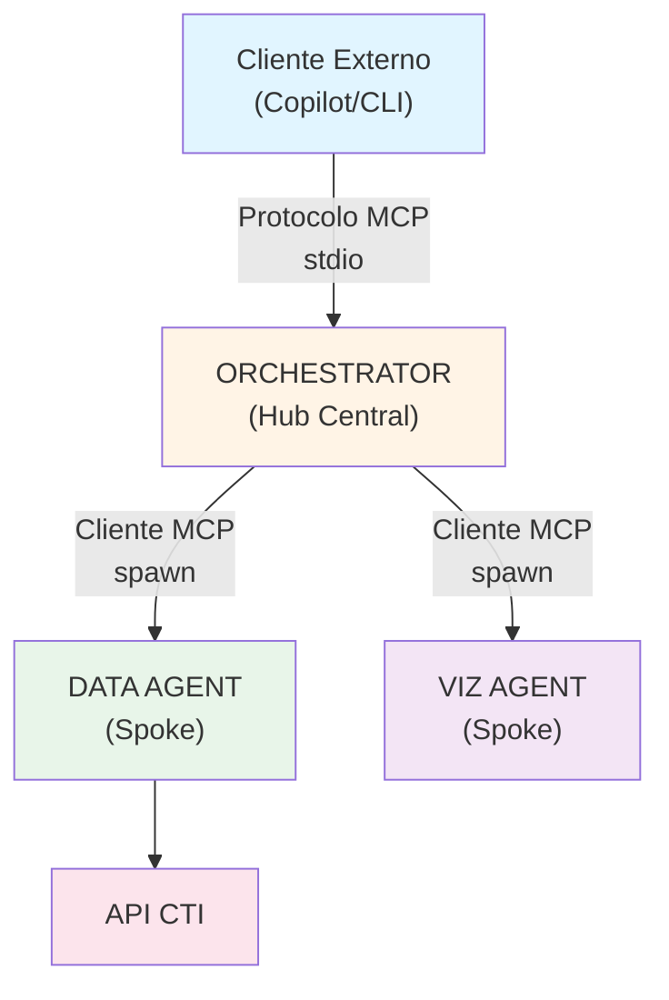
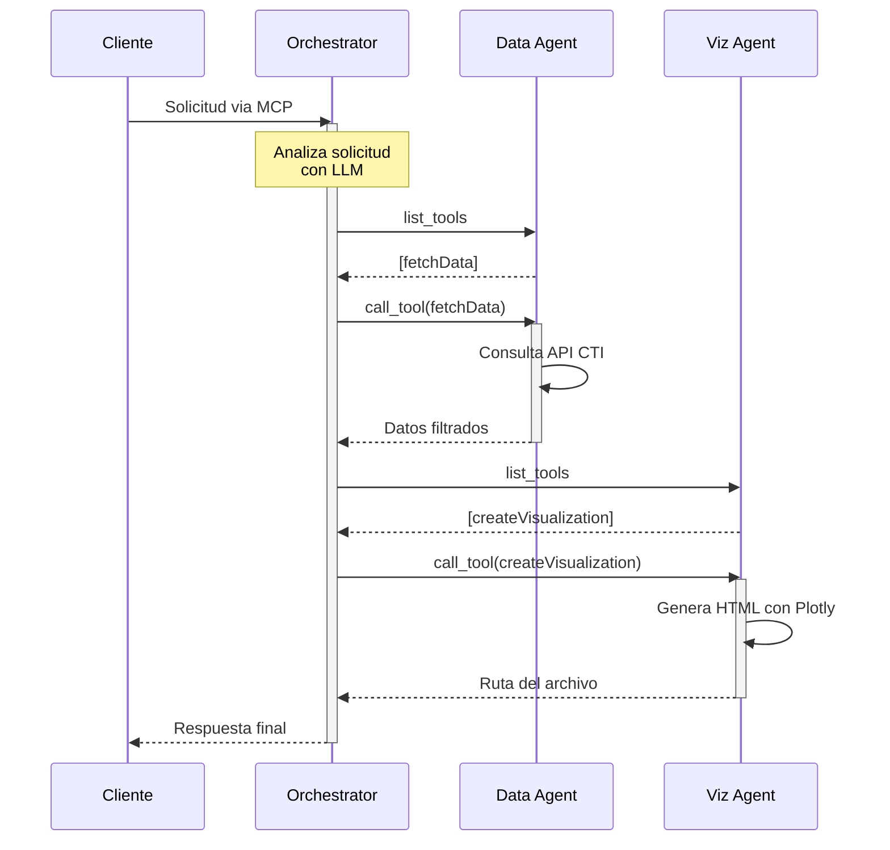

# OpenAgents - Módulo Core

Sistema modular basado en agentes para consultar datos de mediciones eléctricas y generar visualizaciones utilizando una arquitectura hub-and-spoke.

## Tabla de Contenidos

- [Descripción General](#descripción-general)
- [Arquitectura](#arquitectura)
  - [Patrón Hub-and-Spoke](#patrón-hub-and-spoke)
  - [Agentes del Sistema](#agentes-del-sistema)
  - [Flujo de Comunicación](#flujo-de-comunicación)
- [Model Context Protocol (MCP)](#model-context-protocol-mcp)
- [Instalación Rápida](#instalación-rápida)
- [Configuración](#configuración)
- [Uso](#uso)
- [Estructura del Proyecto](#estructura-del-proyecto)
- [Recursos Adicionales](#recursos-adicionales)

---

## Descripción General

OpenAgents Core implementa un sistema distribuido donde **agentes especializados se coordinan a través del Model Context Protocol (MCP)** para entregar capacidades inteligentes de procesamiento de datos y visualización.

**Características principales:**
- Arquitectura hub-and-spoke con separación de responsabilidades
- Comunicación estandarizada mediante MCP
- Soporte multi-proveedor LLM (GitHub Copilot, OpenRouter)
- Agentes especializados intercambiables

---

## Arquitectura

### Patrón Hub-and-Spoke

El sistema implementa una **arquitectura hub-and-spoke** donde el Orchestrator actúa como hub central, coordinando agentes especializados (spokes):



**Principios clave:**
1. **Comunicación Centralizada**: Los agentes especializados NUNCA se comunican directamente entre ellos
2. **Aislamiento de Agentes**: Cada agente opera de forma independiente
3. **Protocolo Estándar**: Toda comunicación usa MCP (JSON-RPC sobre stdio)
4. **Spawning Dinámico**: El orchestrator inicia agentes bajo demanda

### Agentes del Sistema

#### Orchestrator (Hub Central)

**Rol**: Coordinador central y enrutador de solicitudes

**Responsabilidades**:
- Analizar y comprender solicitudes del usuario usando LLM
- Crear planes de ejecución multi-paso
- Coordinar agentes especializados vía MCP
- Agregar y presentar resultados al usuario

**Documentación completa**: [`orchestrator/03-core-orchestrator.md`](./orchestrator/03-core-orchestrator.md)

---

#### Data Agent (Spoke)

**Rol**: Especialista en obtención y procesamiento de datos

**Responsabilidades**:
- Consultar API CTI de mediciones eléctricas
- Filtrar y transformar datos según parámetros
- Validar y normalizar información
- Proporcionar datos estructurados al orchestrator

**Documentación completa**: [`data-agent/03-core-data-agent.md`](./data-agent/03-core-data-agent.md)

---

#### Visualization Agent (Spoke)

**Rol**: Especialista en generación de visualizaciones y análisis de datos

**Responsabilidades**:
- Analizar datos y prompts con LLM para decidir tipo de visualización óptima
- Generar gráficas usando QuickChart API (line, bar, pie, scatter, radar, area, histogram, heatmap)
- Crear tablas exportadas a CSV
- Generar HTML interactivo para visualizaciones complejas (heatmaps grandes)
- Pipeline basado en LangGraph con 3 etapas: Planner → Generator → Saver
- Soporte para herramientas avanzadas: estadísticas, agregación, detección de anomalías

**Arquitectura**:
- **Planner Node**: Usa LLM para generar plan de visualización
- **Generator Node**: Crea gráfica con QuickChart o genera CSV/HTML
- **Saver Node**: Persiste resultado en disco (PNG/CSV/HTML)

**Tipos de visualización soportados**: 9 tipos incluyendo line_chart, bar_chart, pie_chart, scatter, table, area_chart, radar, histogram, heatmap

**Documentación completa**: [`visualization-agent/03-core-viz-agent.md`](./visualization-agent/03-core-viz-agent.md)

---

### Flujo de Comunicación

**Secuencia típica de operación:**



---

## Model Context Protocol (MCP)

MCP es el protocolo estándar que permite la comunicación entre el orchestrator y los agentes especializados.

### Conceptos Clave

**¿Qué es MCP?**
- Protocolo JSON-RPC 2.0 para comunicación entre LLMs y herramientas
- Transporte sobre stdio (entrada/salida estándar)
- Permite descubrimiento dinámico de capacidades

**Componentes principales:**

```typescript
// Servidor MCP (Data Agent, Viz Agent)
interface MCPServer {
  tools: Tool[];          // Herramientas disponibles
  resources?: Resource[]; // Recursos opcionales
  prompts?: Prompt[];     // Prompts opcionales
}

// Cliente MCP (Orchestrator)
interface MCPClient {
  connect(): Promise<void>;
  listTools(): Promise<Tool[]>;
  callTool(name: string, args: any): Promise<any>;
  close(): Promise<void>;
}
```

**Ejemplo de mensaje MCP:**

```json
{
  "jsonrpc": "2.0",
  "id": 1,
  "method": "tools/call",
  "params": {
    "name": "fetchData",
    "arguments": {
      "endpoint": "/carga",
      "startDate": "2024-01-01",
      "endDate": "2024-01-31"
    }
  }
}
```

**Más información**: [Documentación oficial MCP](https://modelcontextprotocol.io/)

---

## Instalación Rápida

### Requisitos Previos

- **Node.js**: >= 18.0.0
- **npm**: >= 9.0.0
- **Proveedor LLM**: GitHub Copilot o OpenRouter con API key

### Instalación

```bash
# Clonar repositorio
git clone <repository-url>
cd openAgents/packages/core

# Instalar dependencias en todos los agentes
npm install
cd orchestrator && npm install && cd ..
cd data-agent && npm install && cd ..
cd visualization-agent && npm install && cd ..

# Compilar todos los agentes
npm run build
```

### Verificación

```bash
# Verificar cada agente individualmente
node orchestrator/dist/index.js
node data-agent/dist/index.js
node visualization-agent/dist/index.js
```

**Instalación detallada por agente**:
- [`orchestrator/03-core-orchestrator.md`](./orchestrator/03-core-orchestrator.md#instalación)
- [`data-agent/03-core-data-agent.md`](./data-agent/03-core-data-agent.md#instalación)
- [`visualization-agent/03-core-viz-agent.md`](./visualization-agent/03-core-viz-agent.md#instalación)

---

## Configuración

### Variables de Entorno Globales

**Configuración compartida por todos los agentes:**

```bash
# .env (en cada carpeta de agente)

# Proveedor LLM (obligatorio)
LLM_PROVIDER=copilot  # o "openrouter"

# GitHub Copilot (si LLM_PROVIDER=copilot)
# No requiere API key adicional - usa autenticación de GitHub CLI

# OpenRouter (si LLM_PROVIDER=openrouter)
OPENROUTER_API_KEY=sk-or-v1-xxxxx
OPENROUTER_MODEL=anthropic/claude-3.5-sonnet  # opcional
```

### Configuración Específica por Agente

Cada agente tiene variables adicionales específicas:

| Agente | Variables Específicas | Documentación |
|--------|----------------------|---------------|
| **Orchestrator** | `DATA_AGENT_PATH`, `VIZ_AGENT_PATH` | [Ver detalles →](./orchestrator/03-core-orchestrator.md#configuración) |
| **Data Agent** | `CTI_BASE_URL`, `CTI_AUTH_HEADER` | [Ver detalles →](./data-agent/03-core-data-agent.md#configuración) |
| **Visualization Agent** | Ninguna adicional requerida | [Ver detalles →](./visualization-agent/03-core-viz-agent.md#configuración) |

---

## Uso

### 1. Modo Servidor MCP (Recomendado)

**Uso con GitHub Copilot CLI:**

```json
// En tu configuración de GitHub Copilot
{
  "mcpServers": {
    "openagents": {
      "command": "node",
      "args": ["packages/core/orchestrator/dist/index.js"],
      "env": {
        "LLM_PROVIDER": "copilot"
      }
    }
  }
}
```

**Interacción:**
```bash
# El orchestrator se ejecuta como servidor MCP
# GitHub Copilot CLI se comunica automáticamente via stdio
```

### 2. Modo Interactivo (Desarrollo/Testing)

```bash
cd orchestrator
node dist/index.js

# Escribe tu solicitud:
> "Muestra la carga eléctrica de enero 2024 en un gráfico de líneas"
```

### 3. Uso como Módulo (Integración)

```typescript
import { Orchestrator } from './orchestrator';

const orchestrator = new Orchestrator();
await orchestrator.initialize();

const result = await orchestrator.processRequest(
  "Visualiza consumo eléctrico del último mes"
);
console.log(result);
```

---

## Estructura del Proyecto

```
packages/core/
├── orchestrator/              # Hub central
│   ├── src/
│   │   ├── index.ts          # Entry point + MCP server
│   │   ├── orchestrator.ts   # Lógica principal
│   │   ├── llm/              # Capa de abstracción LLM
│   │   └── mcp-client/       # Cliente MCP para agentes
│   ├── dist/                 # Código compilado
│   ├── package.json
│
├── data-agent/                # Spoke - Obtención de datos
│   ├── src/
│   │   ├── index.ts          # Entry point + MCP server
│   │   ├── tools/            # Implementación de herramientas
│   │   └── llm/              # LLM para procesamiento
│   ├── dist/
│   ├── package.json
│
├── visualization-agent/       # Spoke - Generación de gráficos
│   ├── src/
│   │   ├── index.ts          # Entry point + MCP server
│   │   ├── tools/            # Herramientas de visualización
│   │   └── llm/              # LLM para configuración
│   ├── dist/
│   ├── package.json
```

---

###  Desarrollo

Para contribuir o extender el sistema:

1. **Agregar nuevo agente**: Seguir patrón hub-and-spoke existente
2. **Agregar proveedor LLM**: Implementar interfaz `LLMProvider` (ver documentación de agentes)
3. **Modificar herramientas**: Actualizar implementación en cada agente


