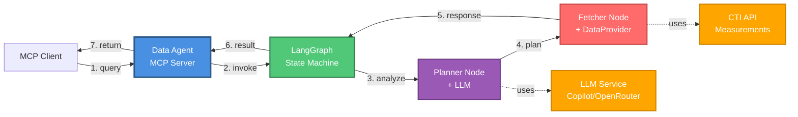
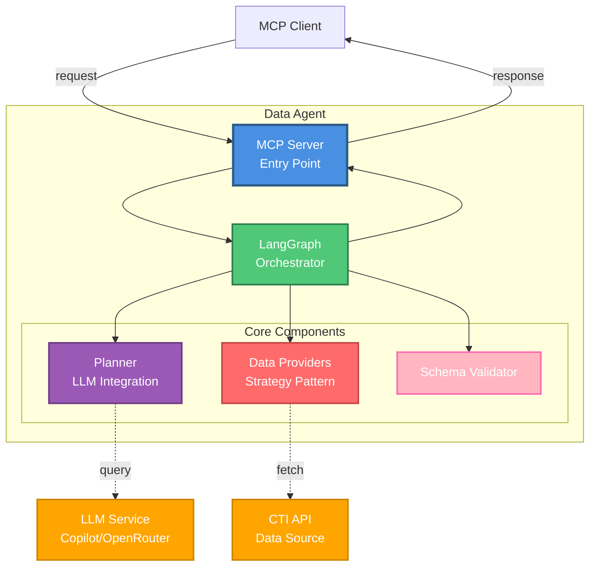

# Data Agent

**Fecha**: 2026-04-06
**Versión**: 1.0.0

## Índice
1. [Descripción](#1-descripción)
2. [Arquitectura](#2-arquitectura)
3. [Componentes](#3-componentes)
  3.1. [MCP Server](#31-mcp-server-srcmcp-serverts)
  3.2. [Data Providers](#32-data-providers-srcproviders)
  3.3. [Graph](#33-graph-srcgraphts)
  3.4. [Planner](#34-planner-srcpromptsts)
  3.5. [Tools](#35-tools-srctoolsts)
  3.6. [Schema Validator](#36-schema-validator)
  3.7. [LLM Abstraction](#37-llm-abstraction-srcllm-flexiblets)
4. [Flujo de Ejecución](#4-flujo-de-ejecución)
5. [Configuración](#5-configuración)
6. [API CTI - Parámetros](#6-api-cti---parámetros)
7. [Uso](#7-uso)
  7.1. [Como MCP Server](#71-como-mcp-server)
  7.2. [Como módulo](#72-como-módulo)
8. [Extensibilidad](#8-extensibilidad)
9. [Estructura de Directorios](#9-estructura-de-directorios)
10. [Dependencias Principales](#10-dependencias-principales)
11. [Desarrollo](#11-desarrollo)
12. [Manejo de Errores](#12-manejo-de-errores)


## 1. Descripción

El Data Agent es un agente especializado en la obtención de datos de mediciones eléctricas. Actúa como interfaz inteligente entre solicitudes en lenguaje natural y consultas estructuradas a diversos proveedores de datos, utilizando un LLM para interpretar las peticiones y generar las llamadas apropiadas.

Implementa el **patrón Strategy** (Data Providers) y utiliza **[@openagents/shared](../shared/03-core-shared.md)** para abstracciones LLM compartidas.

## 2. Arquitectura

El agente utiliza **LangGraph** como orquestador y **@openagents/shared** para LLM Factory centralizado, garantizando consistencia con otros agentes.

### Diagrama de Flujo



**Flujo:**
1. Cliente envía query en lenguaje natural
2. MCP Server invoca LangGraph
3. Planner analiza query con LLM y genera plan estructurado
4. Fetcher obtiene datos del proveedor configurado
5. Response con datos estructurados
6. Graph retorna resultado
7. Cliente recibe respuesta JSON
    
### Diagrama de Componentes



**Componentes principales:**
- **MCP Server**: Punto de entrada que expone `query_cti_measurements`
- **LangGraph**: Orquestador de flujo con 2 nodos (Planner → Fetcher)
- **Planner**: Interpreta queries con LLM y genera plan estructurado
- **Data Providers**: Abstracción para múltiples fuentes (CTI, Postgres, Mongo)
- **Schema Validator**: Valida estructura del plan generado

### Patrones de Diseño Aplicados

#### 1. **Factory Pattern** (LLM Abstraction)
- **Propósito**: Desacoplar el agente de proveedores LLM específicos
- **Implementación**: `LLMFactory` crea instancias de `LLMProvider`
- **Beneficios**: 
  - Cambio de proveedor mediante variable de entorno
  - Facilita testing con mocks
  - Extensible a nuevos LLMs sin modificar código core

#### 2. **Strategy Pattern** (Data Providers)
- **Propósito**: Abstraer la fuente de datos del agente
- **Implementación**: `DataProviderFactory` + interfaz `IDataProvider`
- **Beneficios**:
  - Múltiples fuentes de datos (CTI API, PostgreSQL, MongoDB)
  - Cambio de provider en tiempo de ejecución
  - Fácil agregar nuevas fuentes

#### 3. **State Machine Pattern** (LangGraph)
- **Propósito**: Orquestar flujo de trabajo con estado compartido
- **Nodos**: `planner` (interpreta query) → `fetcher` (obtiene datos)
- **Estado**: `AgentState` compartido entre nodos (immutable updates)

## 3. Componentes

### 3.1. MCP Server (`src/mcp-server.ts`)

Punto de entrada del agente. Expone el tool `query_cti_measurements` vía Model Context Protocol (MCP).

**Interfaz:**
```typescript
{
  name: 'query_cti_measurements',
  inputSchema: {
    query: string,          // Prompt en lenguaje natural
    dataProvider?: string   // Provider: 'cti', 'postgres', 'mongodb' (default: 'cti')
  }
}
```

- Input: Prompt en lenguaje natural + data provider opcional
- Output: JSON con datos estructurados de la fuente de datos

### 3.2. Data Providers (`src/providers/`)

Sistema de proveedores de datos usando **Strategy Pattern** para desacoplar la fuente de datos.

**Arquitectura:**

```typescript
// Interface común para todos los data providers
interface IDataProvider {
  getName(): string;
  getBaseUrl(): string;
  validateParams(params: any): boolean;
  fetchData(url: string, method?: string, config?: DataProviderConfig): Promise<DataProviderResponse>;
}

// Factory para gestionar providers
class DataProviderFactory {
  static async initialize(): Promise<void>;
  static async getProvider(name: string): Promise<IDataProvider>;
  static registerProvider(name: string, provider: IDataProvider): void;
  static listProviders(): string[];
}
```

**Providers disponibles:**

#### CTI Provider (`src/providers/cti-provider.ts`)

**Características:**
- Conecta con API CTI de Ormazabal
- Soporta 12 tipos de mediciones eléctricas
- Filtros: sensorType, meterId, dcId, cimId
- Rangos de tiempo, intervalos, límites
- Manejo de errores HTTP detallado

**Mediciones soportadas:**
- `voltage`, `current`, `active_power`, `reactive_power`
- `active_energy`, `reactive_energy`, `temperature`, `pressure`
- `level`, `tap_position`, `maneuvers`, `meter_event`

**Método principal:**
```typescript
async fetchData(
  url: string,
  method: string = 'GET',
  config?: DataProviderConfig
): Promise<DataProviderResponse>
```

### 3.3. Graph (`src/graph.ts`)

Orquestador basado en LangGraph que coordina el flujo:

**Nodos:**
- `plannerNode`: Interpreta el prompt y genera plan de consulta
- `fetcherNode`: Usa DataProviderFactory para obtener datos

**Estado compartido:**
- `userPrompt`: Query original del usuario
- `dataProvider`: Provider seleccionado ('cti', 'postgres', etc.)
- `rawModelOutput`: Respuesta raw del LLM
- `parsedPlan`: Plan estructurado validado
- `finalUrl`: URL construida para la API
- `apiResponse`: Datos obtenidos
- `error`: Mensaje de error si ocurre

### 3.4. Planner (`src/prompts.ts`)

Sistema de prompts para el LLM que define:
- Measurements disponibles (voltage, current, temperature, etc.)
- Sensor types (TR, DC, TSC, LBT#)
- Field filters por measurement
- Reglas de construcción de queries

### 3.5. Tools (`src/tools.ts`)

**Descripción:** Herramienta para ejecutar consultas a proveedores de datos.

#### fetchCtiDataTool()
```typescript
async fetchCtiDataTool({
  url: string,
  method?: string,
  dataProvider?: string
}): Promise<DataProviderResponse>
```

**Funcionalidad:**
- **Factory Pattern**: Usa `DataProviderFactory.getProvider(dataProvider)` para obtener el provider correcto
- **Validación**: Verifica que el provider esté disponible y los parámetros sean válidos
- **Delegación**: Llama a `provider.fetchData(url, method, config)`
- **Error handling**: Captura y reporta errores con contexto detallado

**Providers soportados:** cti (default), postgres (futuro), mongodb (futuro)

### 3.6. Schema Validator 

Define y valida (`src/cti-schema.ts`):
- Measurements permitidos
- Field filters por measurement
- Sensor types válidos
- Estructura del plan de consulta

### 3.7. LLM Abstraction (desde `@openagents/shared`)

El Data Agent utiliza el paquete compartido **[@openagents/shared](../shared/03-core-shared.md)** para abstracciones LLM, garantizando consistencia con otros agentes del sistema.

**Importado de shared:**

```typescript
import { streamStructuredPlan } from "@openagents/shared/llm";
import { safeJsonParse, deepNullToUndefined } from "@openagents/shared/utils";
```

**Funcionalidades:**

- **LLM Factory**: Gestión centralizada de proveedores LLM (OpenRouter, Copilot)
- **Provider abstraction**: Interfaz común para diferentes LLMs
- **Utilities**: Parsing JSON robusto, normalización de datos

**Ver documentación completa**: [03-core-shared.md](../shared/03-core-shared.md)

Capa de abstracción para providers LLM:
- Soporta GitHub Copilot SDK
- Soporta OpenRouter
- Configuración vía variables de entorno

## 4. Flujo de Ejecución

### Ejemplo: "Dame el voltaje del contador LGZ0011605102 de los últimos 7 días"

1. **Recepción del prompt**
   ```
   MCP Server recibe: { prompt: "Dame el voltaje del contador LGZ0011605102..." }
   ```

2. **Planner analiza con LLM**
   ```json
   {
     "measurement": "voltage",
     "tagFilter": {
       "sensorType": "DC",
       "meterId": "LGZ0011605102"
     },
     "start": "2026-03-23T00:00:00Z",
     "end": "2026-03-30T00:00:00Z"
   }
   ```

3. **Fetcher construye URL**
   ```
   GET http://IP:PORT/api/v2/data/measurements/voltage
     ?sensorType=DC
     &meterId=LGZ0011605102
     &start=2026-03-23T00:00:00Z
     &end=2026-03-30T00:00:00Z
   ```

4. **API responde con datos**
   ```json
   [
     {
       "time": "2026-03-29T19:33:28Z",
       "field": "V_A",
       "value": "235",
       "meterId": "LGZ0011605102",
       "sensorType": "DC"
     },
     ...
   ]
   ```

5. **Retorno al caller**
   ```json
   {
     "success": true,
     "apiResponse": [...],
     "plan": {...}
   }
   ```

## 5. Configuración

### Variables de Entorno (.env)

```env
# LLM Provider
LLM_PROVIDER=copilot|openrouter
COPILOT_MODEL=claude-sonnet-4.5
OPENROUTER_API_KEY=sk-or-v1-...
OPENROUTER_MODEL=nvidia/nemotron-3-nano-30b-a3b:free

# API CTI
CTI_API_BASE_URL=http://192.168.45.18:2022
```

## 6. API CTI - Parámetros

### Measurements Soportados

- `voltage`: Tensión eléctrica por fase
- `current`: Corriente eléctrica por fase
- `active_power`: Potencia activa
- `reactive_power`: Potencia reactiva
- `active_energy`: Energía activa acumulada
- `reactive_energy`: Energía reactiva acumulada
- `temperature`: Temperatura interna
- `pressure`: Presión del aceite
- `level`: Nivel de aceite
- `tap_position`: Posición del tap
- `maneuvers`: Número de maniobras
- `meter_event`: Eventos del contador

### Filtros (tagFilter)

| Parámetro | Descripción | Ejemplo |
|-----------|-------------|---------|
| `sensorType` | Tipo de sensor | TR, DC, TSC, LBT1-5 |
| `meterId` | ID del contador | LGZ0011605102 |
| `dcId` | ID del concentrador | ORM1151800825 |
| `cimId` | ID CIM/CGMES | c663f140-0ebc-... |

### Parámetros Temporales

| Parámetro | Formato | Descripción |
|-----------|---------|-------------|
| `start` | RFC3339 | Fecha inicio |
| `end` | RFC3339 | Fecha fin |
| `interval` | Número | Minutos entre muestras |
| `sampling` | min/max/mean | Tipo de muestreo |
| `limit` | Número | Máximo registros |

## 7. Uso

### 7.1. Como MCP Server

```bash
npm run build
npm run mcp
```

### 7.2. Como módulo

```typescript
import { buildGraph } from './graph.js';

const graph = buildGraph();
const result = await graph.invoke({
  userPrompt: "Dame el voltaje del contador LGZ0011605102",
  dataProvider: 'cti', // o 'postgres', 'mongodb'
  rawModelOutput: "",
  parsedPlan: null,
  finalUrl: null,
  toolResults: [],
  apiResponse: null,
  reasoningTokens: null,
  error: null,
});

console.log(result.apiResponse);
```

## 8. Extensibilidad

### Agregar un Nuevo Data Provider

Para agregar un nuevo proveedor de datos (ej: MySQL, InfluxDB, etc.):

1. **Crear implementación del provider:**

```typescript
// src/providers/mysql-provider.ts
import { IDataProvider, DataProviderResponse } from './index.js';

export class MySQLProvider implements IDataProvider {
  getName(): string {
    return 'mysql';
  }

  getBaseUrl(): string {
    return process.env.MYSQL_HOST || 'localhost:3306';
  }

  validateParams(params: any): boolean {
    // Validar parámetros específicos de MySQL
    return params && params.query;
  }

  async fetchData(query: string): Promise<DataProviderResponse> {
    // Implementar lógica de conexión y query a MySQL
    const connection = await mysql.createConnection({/*...*/});
    const [rows] = await connection.execute(query);
    return {
      success: true,
      data: rows,
    };
  }
}
```

2. **Registrar en el factory:**

```typescript
// src/providers/index.ts
static async initialize(): Promise<void> {
  // ... existing providers
  
  const { MySQLProvider } = await import('./mysql-provider.js');
  this.registerProvider('mysql', new MySQLProvider());
}
```

3. **Usar desde el orchestrator:**

```typescript
// El orchestrator detecta "mysql" en el prompt
// y lo pasa al data-agent automáticamente
await dataAgentClient.queryMeasurements(query, 'mysql');
```

## 9. Estructura de Directorios

```
data-agent/
├── src/
│   ├── mcp-server.ts      # Punto de entrada MCP
│   ├── graph.ts           # LangGraph orchestrator
│   ├── prompts.ts         # Sistema de prompts LLM
│   ├── cti-schema.ts      # Definiciones y validaciones
│   ├── llm-flexible.ts    # Abstracción LLM
│   ├── llm-provider.ts    # Copilot SDK provider
│   ├── utils.ts           # Utilidades
│   └── providers/
│       ├── copilot.ts     # GitHub Copilot integration
│       └── openrouter.ts  # OpenRouter integration
├── dist/                  # Código compilado
├── .env                   # Variables de entorno
├── package.json
├── tsconfig.json
└── README.md
```

## 10. Dependencias Principales

- `@langchain/langgraph`: Orquestación de flujo
- `@langchain/core`: Primitivos de LangChain
- `@modelcontextprotocol/sdk`: Protocolo MCP
- `@github/copilot-sdk`: GitHub Copilot integration
- `axios`: Cliente HTTP
- `zod`: Validación de schemas

## 11. Desarrollo

### Build

```bash
npm run build
```

### Ejecutar como MCP Server

```bash
npm run mcp
```

### Ejecutar en desarrollo (con tsx)

```bash
npm run dev
```

## 12. Manejo de Errores

El agente implementa varios niveles de manejo de errores:

1. **Validación del plan**: Si el LLM genera un plan inválido, se rechaza
2. **Retry HTTP**: Si la API retorna error, intenta con configuración mínima
3. **Timeout**: Peticiones HTTP con timeout de 30 segundos
4. **Parsing robusto**: Maneja respuestas JSON y CSV
5. **Error propagation**: Errores se propagan con mensajes descriptivos


