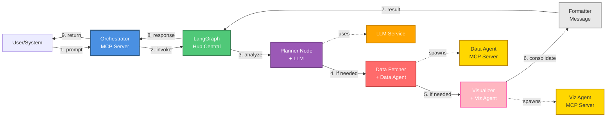
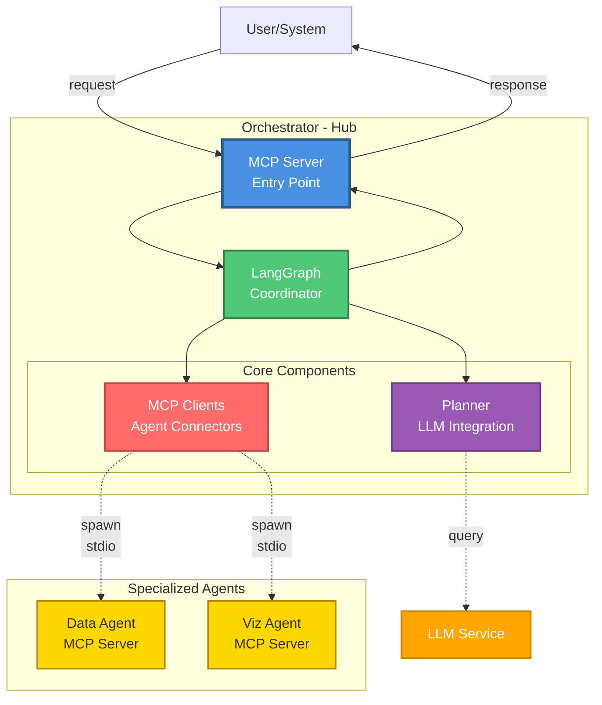

# Orchestrator Agent

**Fecha**: 2026-04-06
**Versión**: 1.0.0

## Índice
1. [Descripción](#1-descripción)
2. [Arquitectura](#2-arquitectura)
  2.1. [Diagrama de Flujo](#21-diagrama-de-flujo)
  2.2. [Diagrama de Componentes](#22-diagrama-de-componentes)
  2.3. [Patrones de Diseño Aplicados](#23-patrones-de-diseño-aplicados)
3. [Componentes](#3-componentes)
  3.1.[MCP Server](#31-mcp-server-srcmcp-serverts)
  3.2. [Graph](#32-graph-srcgraphts)
  3.3. [Planner](#33-planner-srcpromptsts)
  3.4. [MCP Clients](#34-mcp-clients-srcclients)
  3.5. [LLM Abstraction](#35-llm-abstraction-srcllm-flexiblets)
  3.6. [Types](#36-types-srctypests)
4. [Flujo de Ejecución](#4-flujo-de-ejecución)
5. [Configuración](#5-configuración)
6. [Uso](#6-uso)
  6.1. [Como MCP Server](#61-como-mcp-server)
  6.2. [Modo Interactivo (Desarrollo)](#62-modo-interactivo-desarrollo)
  6.3. [Como módulo](#63-como-módulo)
7. [Estructura de Directorios](#7-estructura-de-directorios)
8. [Dependencias Principales](#8-dependencias-principales)
9. [Desarrollo](#9-desarrollo)
10. [Manejo de Errores](#10-manejo-de-errores)
11. [Extensibilidad](#11-extensibilidad)

## 1. Descripción

El Orchestrator es el agente coordinador central del sistema OpenAgents. Actúa como **hub inteligente** que recibe solicitudes en lenguaje natural, las interpreta usando un LLM, y coordina múltiples agentes especializados (data-agent, visualization-agent) para cumplir con la petición del usuario.

Implementa el **patrón Hub-and-Spoke** donde los agentes especializados nunca se comunican directamente entre ellos, solo con el orchestrator. Utiliza Model Context Protocol (MCP) para la comunicación entre agentes.

## 2. Arquitectura

El orchestrator utiliza **LangGraph** como orquestador con 4 nodos secuenciales, y aplica los patrones **Hub-and-Spoke** (coordinación de agentes) y **Factory** (LLM abstraction).

### Diagrama de Flujo



**Flujo (Hub-and-Spoke):**
1. Usuario envía prompt en lenguaje natural
2. Orchestrator invoca LangGraph (hub central)
3. Planner analiza intención y genera plan
4. Data Fetcher consulta data-agent si necesita datos (spoke)
5. Visualizer crea gráfica con viz-agent si necesario (spoke)
6. Formatter consolida resultados
7-9. Respuesta formateada al usuario

**Nota**: Los agentes especializados (spokes) nunca se comunican directamente entre sí.

### Diagrama de Componentes



**Componentes principales:**
- **MCP Server**: Punto de entrada que expone `process_user_request`
- **LangGraph**: Hub central que coordina 4 nodos secuenciales
- **Planner**: Analiza intención del usuario con LLM
- **MCP Clients**: Conectores para spawning de agentes especializados via stdio
- **Spokes**: Agentes especializados (Data, Viz) que operan independientemente
            
            LLM_FACTORY --> LLM_INTERFACE
            LLM_INTERFACE -.-> COPILOT
            LLM_INTERFACE -.-> OPENROUTER
        end
        
        subgraph MCP_LAYER["MCP Clients Layer (Hub-and-Spoke)"]
            direction LR
            
            subgraph DATA_CLIENT_BOX["Data Client"]
                DATA_CLIENT["DataAgentMCPClient<br/>━━━━━━━<br/>stdio transport<br/>timeout: 5min"]
            end
            
            subgraph VIZ_CLIENT_BOX["Viz Client"]
                VIZ_CLIENT["VizAgentMCPClient<br/>━━━━━━━<br/>stdio transport<br/>timeout: 2min"]
            end
        end
        
        PROMPTS["Prompt System<br/>Templates<br/>Agent Capabilities"]
        TYPES["Type Definitions<br/>OrchestratorPlan<br/>State"]
        UTILS["Utils<br/>JSON Parsing<br/>Formatters"]
    end
    
    subgraph Spokes["Specialized Agents (Spokes)"]
        direction LR
        DATA_AGENT["Data Agent<br/>════════════<br/>MCP Server<br/>Tool: query_cti_measurements<br/>Provider: CTI/Postgres/Mongo"]
        VIZ_AGENT["Viz Agent<br/>════════════<br/>MCP Server<br/>Tool: create_visualization<br/>Provider: QuickChart/Plotly"]
    end
    
    CLIENT ==>|"1. MCP Request"| MCP_SERVER
    MCP_SERVER ==>|"2. Invoke"| LANGGRAPH
    
    LANGGRAPH <-->|"3. Planner uses"| LLM_FACTORY
    COPILOT -->|"4. API Call"| LLM_EXT
    OPENROUTER -->|"4. API Call"| LLM_EXT
    
    LANGGRAPH <-->|"5. Fetcher spawns"| DATA_CLIENT
    DATA_CLIENT -.->|"MCP stdio"| DATA_AGENT
    DATA_AGENT -.->|"Response"| DATA_CLIENT
    
    LANGGRAPH <-->|"6. Visualizer spawns"| VIZ_CLIENT
    VIZ_CLIENT -.->|"MCP stdio"| VIZ_AGENT
    VIZ_AGENT -.->|"Response"| VIZ_CLIENT
    
    LANGGRAPH -->|"7. Uses"| PROMPTS
    LANGGRAPH -->|"8. Uses"| TYPES
    LANGGRAPH -->|"9. Uses"| UTILS
    
    LANGGRAPH ==>|"10. Response"| MCP_SERVER
    MCP_SERVER ==>|"11. MCP Response"| CLIENT
    
    classDef entry fill:#4A90E2,stroke:#2E5C8A,stroke-width:3px,color:#fff,font-weight:bold
    classDef orchestrator fill:#50C878,stroke:#2D7A4A,stroke-width:3px,color:#fff,font-weight:bold
    classDef factory fill:#9B59B6,stroke:#6C3A82,stroke-width:3px,color:#fff,font-weight:bold
    classDef interface fill:#E8E8E8,stroke:#666,stroke-width:2px,color:#333
    classDef provider fill:#F0F0F0,stroke:#999,stroke-width:2px,color:#333
    classDef client fill:#FF6B6B,stroke:#C44545,stroke-width:3px,color:#fff,font-weight:bold
    classDef agent fill:#FFD700,stroke:#B8860B,stroke-width:4px,color:#333,font-weight:bold
    classDef util fill:#FFB6C1,stroke:#FF69B4,stroke-width:2px,color:#333
    classDef external fill:#FFA500,stroke:#CC8400,stroke-width:3px,color:#fff,font-weight:bold
    
    class MCP_SERVER entry
    class LANGGRAPH orchestrator
    class LLM_FACTORY factory
    class LLM_INTERFACE interface
    class COPILOT,OPENROUTER provider
    class DATA_CLIENT,VIZ_CLIENT client
    class DATA_AGENT,VIZ_AGENT agent
    class PROMPTS,TYPES,UTILS util
    class CLIENT,LLM_EXT external
```

### Patrones de Diseño Aplicados

#### 1. **Hub-and-Spoke Pattern** (Coordinación de Agentes)
- **Propósito**: Centralizar coordinación de agentes especializados
- **Implementación**: Orchestrator como hub, agentes especializados como spokes
- **Beneficios**:
  - Desacoplamiento total entre agentes
  - Fácil agregar nuevos agentes sin afectar existentes
  - Trazabilidad centralizada (logging)
  - Testing simplificado (mock individual de agentes)

#### 2. **Factory Pattern** (LLM Abstraction)
- **Propósito**: Desacoplar el orchestrator de proveedores LLM específicos
- **Implementación**: `LLMFactory` crea instancias de `LLMProvider`
- **Beneficios**:
  - Cambio de proveedor mediante variable de entorno
  - Facilita testing con mocks
  - Extensible a nuevos LLMs sin modificar código core

#### 3. **State Machine Pattern** (LangGraph)
- **Propósito**: Orquestar flujo de trabajo con estado compartido
- **Nodos**: `planner` → `dataFetcher` → `visualizer` → `formatter`
- **Estado**: `OrchestratorState` compartido entre nodos (immutable updates)

## 3. Componentes

### 3.1. MCP Server (`src/mcp-server.ts`)

Punto de entrada del orchestrator. Expone el tool `process_user_request` vía Model Context Protocol (MCP).

**Interfaz:**
```typescript
{
  name: 'process_user_request',
  inputSchema: {
    prompt: string  // Solicitud en lenguaje natural
  }
}
```

- Input: Prompt del usuario
- Output: Mensaje formateado + metadatos (dataRecordCount, visualizationPath)

### 3.2. Graph (`src/graph.ts`)

Orquestador basado en LangGraph que coordina el flujo en 4 etapas.

**Nodos:**
- `plannerNode`: Analiza prompt con LLM y genera plan de ejecución
- `dataFetcherNode`: Invoca data-agent via MCP si necesita datos
- `visualizerNode`: Invoca viz-agent via MCP si necesita gráfica
- `formatterNode`: Consolida resultados y genera mensaje final

**Estado compartido (OrchestratorState):**
- `userPrompt`: Solicitud original del usuario
- `plan`: Plan estructurado generado por LLM
- `dataAgentResponse`: Datos obtenidos del data-agent
- `vizAgentResponse`: Visualización generada por viz-agent
- `finalMessage`: Mensaje formateado para el usuario
- `mcpClient`, `vizMcpClient`: Clientes MCP para agentes
- `error`: Mensaje de error si ocurre

### 3.3. Planner (`src/prompts.ts`)

Sistema de prompts que instruye al LLM sobre capacidades de agentes y cómo generar planes.

**Define:**
- Agentes disponibles y sus herramientas
- Reglas de coordinación y decisión
- Palabras clave para detección de intención
- Estructura del plan de ejecución

**Plan generado (OrchestratorPlan):**
```typescript
{
  task: 'data' | 'visualization' | 'data_and_visualization' | 'analysis',
  dataAgentPrompt?: string,      // Query para data-agent
  needsVisualization: boolean,   // Si crear gráfica
  vizInstructions?: string,      // Instrucciones para viz-agent
  rationale?: string             // Explicación de decisiones
}
```

### 3.4. MCP Clients (`src/clients/`)

Clientes MCP para comunicarse con agentes especializados vía stdio.

#### DataAgentMCPClient (`data-agent-mcp-client.ts`)

**Funcionalidad:**
- Spawn proceso del data-agent via stdio
- Conecta usando MCP SDK
- Invoca tool `query_cti_measurements`
- Timeout de 5 minutos para consultas largas
- Cierre limpio de conexión

**Métodos:**
```typescript
async connect(): Promise<void>
async queryMeasurements(query: string, dataProvider?: string): Promise<any>
async close(): Promise<void>
```

#### VizAgentMCPClient (`viz-agent-mcp-client.ts`)

**Funcionalidad:**
- Spawn proceso del viz-agent via stdio
- Conecta usando MCP SDK
- Invoca tool `create_visualization`
- Pasa datos + prompt del usuario
- Retorna path de imagen generada

**Métodos:**
```typescript
async connect(): Promise<void>
async createVisualization(prompt: string, data: any[], outputDir?: string): Promise<any>
async close(): Promise<void>
```

### 3.5. LLM Abstraction (`src/llm-flexible.ts`)

Capa de abstracción para proveedores LLM usando **Factory Pattern**.

**LLMFactory:**
- Singleton para gestión centralizada
- Crea provider según configuración de entorno
- Soporta Copilot SDK y OpenRouter

**Configuración:**
```env
LLM_PROVIDER=copilot|openrouter
COPILOT_MODEL=claude-sonnet-4.5
OPENROUTER_API_KEY=sk-or-v1-...
OPENROUTER_MODEL=nvidia/nemotron-3-nano-30b-a3b:free
```

### 3.6. Types (`src/types.ts`)

Definiciones de tipos TypeScript para el sistema.

```typescript
interface OrchestratorPlan {
  task: TaskType;
  dataAgentPrompt?: string;
  needsVisualization: boolean;
  vizInstructions?: string;
  rationale?: string;
}

interface DataAgentResponse {
  success: boolean;
  apiResponse?: any[];
  plan?: any;
  error?: string;
}
```

## 4. Flujo de Ejecución

### Ejemplo: "Dame una gráfica del voltaje del contador LGZ0011605102 de los últimos 30 días"

1. **MCP Server recibe request**
   ```json
   {
     "tool": "process_user_request",
     "arguments": {
       "prompt": "Dame una gráfica del voltaje del contador LGZ0011605102..."
     }
   }
   ```

2. **PlannerNode analiza con LLM**
   - Identifica intención: datos + visualización
   - Genera plan estructurado:
   ```json
   {
     "task": "data_and_visualization",
     "dataAgentPrompt": "voltaje del contador LGZ0011605102 de los últimos 30 días",
     "needsVisualization": true,
     "vizInstructions": "gráfica de líneas del voltaje",
     "rationale": "Usuario solicita datos y visualización"
   }
   ```

3. **DataFetcherNode invoca data-agent**
   - Crea DataAgentMCPClient
   - Conecta via stdio al data-agent MCP server
   - Llama tool `query_cti_measurements`
   - Obtiene respuesta:
   ```json
   {
     "success": true,
     "apiResponse": [
       {"time": "2026-03-01T00:00:00Z", "field": "V_A", "value": "235"},
       {"time": "2026-03-01T01:00:00Z", "field": "V_A", "value": "234"},
       ...
     ],
     "plan": {"measurement": "voltage", "tagFilter": {...}}
   }
   ```

4. **VisualizerNode invoca viz-agent**
   - Crea VizAgentMCPClient
   - Conecta via stdio al viz-agent MCP server
   - Llama tool `create_visualization` con datos obtenidos
   - Obtiene respuesta:
   ```json
   {
     "success": true,
     "imagePath": "output/chart_1743320394582.png",
     "plan": {"chartType": "line_chart", "title": "Voltaje"}
   }
   ```

5. **FormatterNode consolida resultado**
   - Cuenta registros: 720
   - Genera mensaje amigable:
   ```
   ✓ Datos obtenidos: 720 registros
   ✓ Visualización generada: output/chart_1743320394582.png
   
   Se ha generado una gráfica de líneas mostrando el voltaje del contador
   LGZ0011605102 durante los últimos 30 días.
   ```

6. **Response al caller**
   ```json
   {
     "content": [{
       "type": "text",
       "text": "✓ Datos obtenidos: 720 registros..."
     }],
     "isError": false
   }
   ```

## 5. Configuración

### Variables de Entorno (.env)

```env
# LLM Provider
LLM_PROVIDER=copilot|openrouter
COPILOT_MODEL=claude-sonnet-4.5
OPENROUTER_API_KEY=sk-or-v1-...
OPENROUTER_MODEL=nvidia/nemotron-3-nano-30b-a3b:free

# MCP Agent Paths (relative to orchestrator)
DATA_AGENT_MCP_PATH=../data-agent/dist/mcp-server.js
VIZ_AGENT_MCP_PATH=../visualization-agent/dist/mcp-server.js
```

## 6. Uso

### 6.1. Como MCP Server

```bash
npm run build
npm run mcp
```

### 6.2. Modo Interactivo (Desarrollo)

```bash
npx tsx scripts/interactive.ts
```

Luego ingresar prompts directamente:
```
> Dame el voltaje del contador LGZ0011605102
> Dame una gráfica del voltaje de los últimos 7 días
> Muéstrame la temperatura del transformador TR001
```

### 6.3. Como módulo

```typescript
import { buildGraph } from './graph.js';

const graph = buildGraph();
const result = await graph.invoke({
  userPrompt: "Dame una gráfica del voltaje del contador LGZ0011605102",
  plan: null,
  dataAgentResponse: null,
  vizAgentResponse: null,
  finalMessage: "",
  mcpClient: null,
  vizMcpClient: null,
  error: null
});

console.log(result.finalMessage);
```

## 7. Estructura de Directorios

```
orchestrator/
├── src/
│   ├── mcp-server.ts      # Punto de entrada MCP
│   ├── graph.ts           # LangGraph orchestrator
│   ├── prompts.ts         # Sistema de prompts LLM
│   ├── types.ts           # Definiciones TypeScript
│   ├── utils.ts           # Utilidades (JSON parsing)
│   ├── llm-flexible.ts    # Abstracción LLM
│   ├── llm-provider.ts    # Interfaz LLMProvider
│   ├── clients/
│   │   ├── data-agent-mcp-client.ts  # Cliente MCP data-agent
│   │   └── viz-agent-mcp-client.ts   # Cliente MCP viz-agent
│   └── providers/
│       ├── copilot.ts     # GitHub Copilot integration
│       └── openrouter.ts  # OpenRouter integration
├── scripts/
│   └── interactive.ts     # Script CLI interactivo
├── dist/                  # Código compilado
├── output/                # Archivos generados
├── .env                   # Variables de entorno
├── package.json
├── tsconfig.json
└── README.md
```

## 8. Dependencias Principales

- `@langchain/langgraph`: Orquestación de flujo
- `@langchain/core`: Primitivos de LangChain
- `@modelcontextprotocol/sdk`: Protocolo MCP (cliente y servidor)
- `@github/copilot-sdk`: GitHub Copilot integration
- `zod`: Validación de schemas
- `readline`: CLI interactivo

## 9. Desarrollo

**Build**

```bash
npm run build
```

**Ejecutar como MCP Server**

```bash
npm run mcp
```

**Modo Interactivo**

```bash
npx tsx scripts/interactive.ts
```

## 10. Manejo de Errores

El orchestrator implementa varios niveles de resiliencia:

1. **Validación del plan**: Si el LLM genera un plan inválido, se rechaza
2. **Timeout de agentes**: 
   - Data-agent: 5 minutos para consultas largas
   - Viz-agent: 2 minutos para generación de gráficas
3. **Fallback gracioso**: Si un agente falla, retorna datos parciales
4. **Cleanup de recursos**: Cierra conexiones MCP al finalizar
5. **Error propagation**: Errores se propagan con contexto al usuario
6. **Logging centralizado**: Todos los pasos se loggean para debugging

## 11. Extensibilidad

### Agregar nuevo agente especializado

1. **Crear cliente MCP:**

```typescript
// src/clients/analysis-agent-mcp-client.ts
export class AnalysisAgentMCPClient {
  async connect(): Promise<void> { /* ... */ }
  async analyzeData(data: any[]): Promise<any> { /* ... */ }
  async close(): Promise<void> { /* ... */ }
}
```

2. **Actualizar OrchestratorPlan:**

```typescript
// src/types.ts
interface OrchestratorPlan {
  task: TaskType;
  dataAgentPrompt?: string;
  needsVisualization: boolean;
  needsAnalysis?: boolean;  // Nuevo
  analysisInstructions?: string;  // Nuevo
}
```

3. **Agregar nodo al graph:**

```typescript
// src/graph.ts
const analysisNode = async (state: typeof OrchestratorState.State) => {
  if (!state.plan?.needsAnalysis) return {};
  
  const client = new AnalysisAgentMCPClient();
  await client.connect();
  const result = await client.analyzeData(state.dataAgentResponse?.apiResponse);
  await client.close();
  
  return { analysisResponse: result };
};

// Actualizar grafo
.addNode("analysis", analysisNode)
.addEdge("visualizer", "analysis")
.addEdge("analysis", "formatter")
```

4. **Actualizar prompts:**

```typescript
// src/prompts.ts
export function buildPlannerPrompt(): string {
  return `
    Available agents:
    - data-agent: Query electrical measurements
    - viz-agent: Create visualizations
    - analysis-agent: Statistical analysis  // Nuevo
    
    When to use analysis-agent:
    - User asks for statistics, trends, anomalies
    - Set needsAnalysis: true
  `;
}
```

5. **Configurar en .env:**

```env
ANALYSIS_AGENT_MCP_PATH=../analysis-agent/dist/mcp-server.js
```
