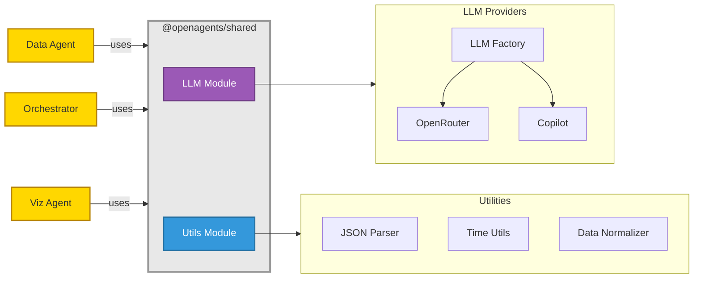

# Shared Package - @openagents/shared

**Fecha**: 2026-04-06  
**Versión**: 0.1.0

## Índice

1. [Descripción](#1-descripción)
2. [Arquitectura](#2-arquitectura)  
   2.1. [Diagrama de Componentes](#21-diagrama-de-componentes)  
   2.2. [Patrones de Diseño Aplicados](#22-patrones-de-diseño-aplicados)
3. [Módulos](#3-módulos)  
   3.1. [LLM Module](#31-llm-module)  
   3.2. [Utils Module](#32-utils-module)
4. [Configuración](#4-configuración)
5. [Uso](#5-uso)  
   5.1. [Como dependencia](#51-como-dependencia)  
   5.2. [Importar LLM](#52-importar-llm)  
   5.3. [Importar Utils](#53-importar-utils)
6. [Estructura de Directorios](#6-estructura-de-directorios)
7. [Dependencias Principales](#7-dependencias-principales)
9. [Desarrollo](#9-desarrollo)
10. [Métricas de Impacto](#10-métricas-de-impacto)

## 1. Descripción

El paquete `@openagents/shared` es una biblioteca compartida que centraliza abstracciones, proveedores LLM y utilidades comunes entre los agentes del ecosistema OpenAgents. 

Creado en **Fase 1 de refactorización** para eliminar ~800 líneas de código duplicado entre data-agent, orchestrator y visualization-agent.

**Beneficios:**
- ✅ Eliminación de duplicación masiva (3 copias idénticas → 1 implementación)
- ✅ Mantenimiento centralizado de proveedores LLM
- ✅ Consistencia garantizada entre todos los agentes
- ✅ Testing simplificado (una suite en lugar de tres)

**Agentes que lo utilizan:**
- [Data Agent](../data-agent/03-core-data-agent.md)
- [Orchestrator](../orchestrator/03-core-orchestrator.md)
- [Visualization Agent](../visualization-agent/03-core-viz-agent.md)

## 2. Arquitectura

### 2.1. Diagrama de Componentes



**Componentes principales:**
- **LLM Module**: Sistema completo de abstracción de LLMs (Factory + Providers)
- **Utils Module**: Funciones de utilidad comunes (JSON, Time, Data)  
- **Providers**: Implementaciones concretas para OpenRouter y Copilot

### 2.2. Patrones de Diseño Aplicados

#### 1. **Factory Pattern** (LLM Abstraction)

- **Propósito**: Desacoplar agentes de proveedores LLM específicos
- **Implementación**: `LLMFactory` crea instancias según configuración
- **Beneficios**: Cambio de proveedor mediante variable de entorno, fácil testing

#### 2. **Strategy Pattern** (Provider Selection)

- **Propósito**: Seleccionar proveedor en tiempo de ejecución
- **Implementación**: Factory selecciona provider basado en `LLM_PROVIDER`
- **Beneficios**: Intercambiabilidad, extensibilidad

#### 3. **Singleton Pattern** (Factory Instance)

- **Propósito**: Cachear instancia de provider
- **Implementación**: `LLMFactory.getProvider()` retorna instancia cacheada
- **Beneficios**: Performance, gestión centralizada de recursos

## 3. Módulos

### 3.1. LLM Module

Sistema completo para abstracción de Large Language Models. Ver detalles completos en `packages/core/shared/README.md`.

**Componentes:**
- `LLMFactory`: Factory para crear proveedores
- `LLMProvider`: Interfaz base
- `OpenRouterProvider`: Cliente OpenRouter
- `CopilotProvider`: Cliente GitHub Copilot SDK

**API principal:**

```typescript
import { streamStructuredPlan } from '@openagents/shared/llm';

const response = await streamStructuredPlan({
  systemPrompt: "You are a helpful assistant",
  userPrompt: "Generate a plan"
});
```

### 3.2. Utils Module

Funciones de utilidad comunes.

**Funciones:**
- `safeJsonParse<T>(text: string): T` - Parse JSON robusto con soporte para markdown
- `getTimeRFC3339(): string` - Timestamp en formato ISO 8601
- `deepNullToUndefined(value: any): any` - Normalizar null a undefined recursivamente

**API principal:**

```typescript
import { safeJsonParse, getTimeRFC3339, deepNullToUndefined } from '@openagents/shared/utils';

const data = safeJsonParse('```json\n{"key": "value"}\n```');
const timestamp = getTimeRFC3339();
const normalized = deepNullToUndefined({ a: null, b: { c: null } });
```

## 4. Configuración

### Variables de Entorno

```bash
# Provider Selection
LLM_PROVIDER=openrouter  # o "copilot"

# OpenRouter
OPENROUTER_API_KEY=your-key-here
OPENROUTER_MODEL=nvidia/nemotron-3-nano-30b-a3b:free

# Copilot
COPILOT_MODEL=claude-sonnet-4.5
```

## 5. Uso

### 5.1. Como dependencia

```json
{
  "dependencies": {
    "@openagents/shared": "file:../shared"
  }
}
```

### 5.2. Importar LLM

```typescript
import { streamStructuredPlan, getLLMProvider } from '@openagents/shared/llm';
```

### 5.3. Importar Utils

```typescript
import { safeJsonParse, getTimeRFC3339 } from '@openagents/shared/utils';
```

## 6. Estructura de Directorios

```
shared/
├── src/
│   ├── llm/
│   │   ├── factory.ts
│   │   ├── provider.interface.ts
│   │   ├── providers/
│   │   │   ├── openrouter.ts
│   │   │   └── copilot.ts
│   │   └── index.ts
│   ├── utils/
│   │   ├── json.ts
│   │   ├── time.ts
│   │   ├── data.ts
│   │   └── index.ts
│   └── index.ts
├── dist/
├── package.json
└── tsconfig.json
```

## 7. Dependencias Principales

```json
{
  "@github/copilot-sdk": "^0.2.0",
  "@langchain/core": "^1.1.36",
  "openai": "^6.0.0",
  "zod": "^3.23.8"
}
```

## 8. Desarrollo

```bash
# Compilar
npm run build

# Watch mode
npm run dev
```

## 9. Métricas de Impacto

| Métrica | Antes | Después | Mejora |
|---------|-------|---------|--------|
| Archivos LLM | 12 (4 × 3) | 6 | -50% |
| Líneas duplicadas | ~800+ | 0 | -100% |
| Lugares de mantenimiento | 3 | 1 | -66% |

---
