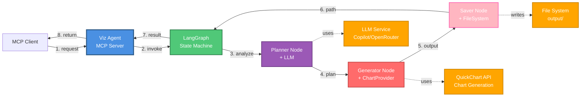
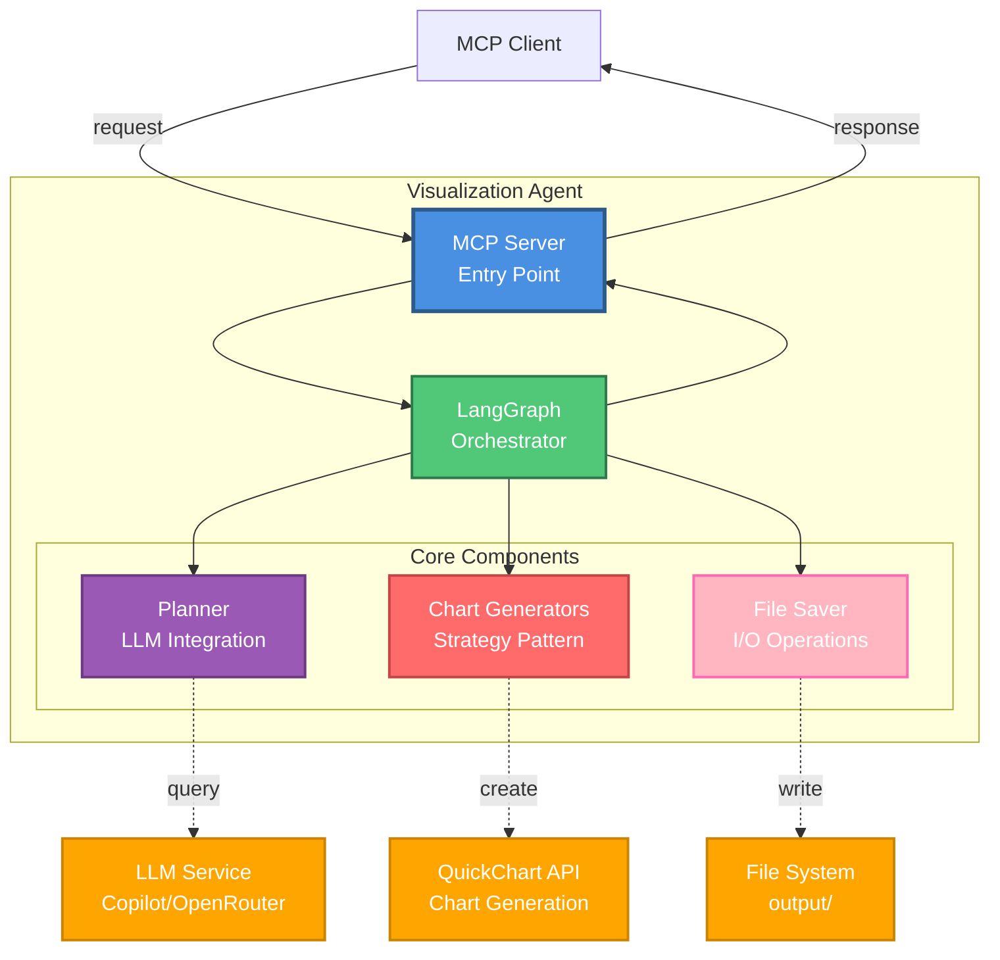

# Visualization Agent

**Fecha**: 2026-04-06
**Versión**: 1.0.0

## Índice
1. [Descripción](#1-descripción)
2. [Arquitectura](#2-arquitectura)
3. [Componentes](#3-componentes)
   3.1. [MCP Server](#31-mcp-server-srcmcp-serverts)
   3.2. [Graph](#32-graph-srcgraphts)
   3.3. [Planner](#33-planner-srcplannerts)
   3.4. [Chart Generators](#34-chart-generators-srcgenerators)
   3.5. [Tools](#35-tools-srctoolsts)
   3.6. [Types](#36-types-srctypests)
   3.7. [LLM Abstraction](#37-llm-abstraction)
   3.8. [LLM Provider](#38-llm-provider)
4. [Flujo de Ejecución](#4-flujo-de-ejecución)
5. [Configuración](#5-configuración)
    5.1. [Variables de Entorno](#51-variables-de-entorno)
    5.2. [Instalación](#52-instalación)
    5.3. [Ejecución](#53-ejecución)
6. [Tipos de Visualización Detallados](#6-tipos-de-visualización-detallados)
    6.1. [Line Chart](#61-line-chart-gráfica-de-líneas)
    6.2. [Bar Chart](#62-bar-chart-gráfica-de-barras)
    6.3. [Pie Chart](#63-pie-chart-gráfica-circular)
    6.4. [Scatter](#64-scatter-diagrama-de-dispersión)
    6.5. [Area Chart](#65-area-chart-gráfica-de-área)
    6.6. [Radar Chart](#66-radar-chart-gráfica-de-radar)
    6.7. [Histogram](#67-histogram-histograma)
    6.8. [Heatmap](#68-heatmap-mapa-de-calor)
    6.9. [Table](#69-table-tabla)
7. [Herramientas de Análisis Avanzadas](#7-herramientas-de-análisis-avanzadas)
8. [Uso](#8-uso)
    8.1. [Como MCP Server](#81-como-mcp-server)
    8.2. [Como módulo](#82-como-módulo)
    8.3. [Integración con Orchestrator](#83-integración-con-orchestrator)
9. [Estructura de Directorios](#9-estructura-de-directorios)
10. [Dependencias Principales](#10-dependencias-principales)
11. [Manejo de Errores](#11-manejo-de-errores)
12. [Extensibilidad](#12-extensibilidad)
   12.1. [Agregar nuevo tipo de gráfica](#121-agregar-nuevo-tipo-de-gráfica)
   12.2. [Agregar nuevo Chart Provider](#122-agregar-nuevo-chart-provider)


## 1. Descripción

El Visualization Agent es un agente especializado en la generación de visualizaciones de datos. Recibe datos estructurados y un prompt en lenguaje natural, y crea gráficos profesionales adaptándose al contexto de los datos. Utiliza **LangGraph** para orquestar un pipeline de 3 etapas y un **LLM** para decidir inteligentemente qué tipo de visualización es más apropiada.

## 2. Arquitectura

El agente utiliza **LangGraph** como orquestador con 3 nodos secuenciales, y aplica los patrones **Strategy** (Chart Generators) y **Factory** (LLM) para desacoplar dependencias externas.

### Diagrama de Flujo



**Flujo:**
1. Cliente envía prompt y datos
2. MCP Server invoca LangGraph
3. Planner analiza datos con LLM y decide tipo de gráfica
4. Generator crea visualización usando proveedor configurado
5. Saver persiste resultado en disco (PNG/CSV/HTML)
6. Path del archivo generado
7. Graph retorna resultado
8. Cliente recibe path y metadata

### Diagrama de Componentes



**Componentes principales:**
- **MCP Server**: Punto de entrada que expone `create_visualization`
- **LangGraph**: Orquestador de flujo con 3 nodos (Planner → Generator → Saver)
- **Planner**: Analiza datos con LLM y decide tipo de visualización
- **Chart Generators**: Abstracción para múltiples proveedores (QuickChart, Plotly, Chart.js)
- **Saver**: Persiste resultados en múltiples formatos (PNG, CSV, HTML)

### Patrones de Diseño Aplicados

#### 1. **Factory Pattern** (LLM Abstraction)
- **Propósito**: Desacoplar el agente de proveedores LLM específicos
- **Implementación**: `LLMFactory` crea instancias de `LLMProvider`
- **Beneficios**: 
  - Cambio de proveedor mediante variable de entorno
  - Facilita testing con mocks
  - Extensible a nuevos LLMs sin modificar código core

#### 2. **Strategy Pattern** (Chart Generators)
- **Propósito**: Abstraer el método de generación de gráficas
- **Implementación**: `ChartGeneratorFactory` + interfaz `IChartGenerator`
- **Beneficios**:
  - Múltiples generadores (QuickChart, Chart.js, Plotly)
  - Cambio de generador en tiempo de ejecución
  - Fácil agregar nuevos proveedores de gráficas

#### 3. **State Machine Pattern** (LangGraph)
- **Propósito**: Orquestar flujo de trabajo con estado compartido
- **Nodos**: `planner` (decide tipo) → `generator` (crea chart) → `saver` (persiste archivo)
- **Estado**: `VizState` compartido entre nodos (immutable updates)

### Tipos de Visualización Soportados

- **`line_chart`**: Series temporales y tendencias
- **`bar_chart`**: Comparaciones categóricas o temporales
- **`pie_chart`**: Distribuciones porcentuales
- **`scatter`**: Correlaciones entre variables
- **`area_chart`**: Series temporales apiladas
- **`radar`**: Comparación multivariable
- **`histogram`**: Distribución de frecuencias
- **`heatmap`**: Patrones de intensidad 2D
- **`table`**: Datos tabulares en CSV

## 3. Componentes

### 3.1. MCP Server (`src/mcp-server.ts`)

**Descripción:** Servidor MCP que expone el agente como herramienta `create_visualization`.

**Clase principal:** `VisualizationMCPServer`
- Inicializa servidor MCP sobre transporte stdio
- Registra handlers para `tools/list` y `tools/call`
- Maneja ciclo de vida del servidor (SIGINT, SIGTERM)
- Gestiona cleanup de recursos LLM

**Tool expuesto:**
```typescript
{
  name: 'create_visualization',
  description: 'Create data visualizations (charts, tables) based on natural language prompts',
  inputSchema: {
    prompt: string,           // Descripción en lenguaje natural
    data: Array<object>,      // Datos a visualizar
    suggestedType?: string,   // Tipo sugerido (opcional)
    chartProvider?: string,   // Provider de gráficas: 'quickchart', 'chartjs', 'plotly' (default: 'quickchart')
    outputDir?: string        // Directorio de salida (default: ./output)
  }
}
```

**Response:**
```typescript
{
  success: boolean,
  imagePath?: string,
  imageUrl?: string,
  format?: 'png' | 'html',
  plan?: VisualizationPlan,
  error?: string,
  metadata: {
    timestamp: string,
    dataPoints: number,
    generationTimeMs: number
  }
}
```

### 3.2. Graph (`src/graph.ts`)

Orquestador basado en LangGraph que coordina el flujo de visualización en 3 etapas.

**Nodos:**
- `plannerNode`: Analiza datos y genera plan de visualización con LLM
- `generatorNode`: Usa ChartGeneratorFactory para crear la gráfica
- `saverNode`: Persiste el resultado (imagen, CSV o HTML) en disco

**Estado compartido (VizState):**
- `request`: Solicitud original (prompt + data + provider)
- `plan`: Plan estructurado de visualización
- `imageUrl`, `csvContent`, `htmlContent`: Outputs generados
- `filePath`, `fileSize`: Información del archivo guardado
- `config`: Configuración de dimensiones y estilos
- `outputDir`: Directorio de salida
- `error`: Mensaje de error si ocurre

**Función auxiliar:**
```typescript
executeVisualization(
  request: VisualizationRequest,
  config?: ChartConfig,
  outputDir?: string
): Promise<GraphResult>
```

### 3.3. Planner (`src/planner.ts`)

Sistema de prompts que usa LLM para analizar datos y decidir la mejor visualización.

**Funcionalidad:**
- Describe 9 tipos de gráficas con casos de uso
- Vista previa de datos y campos disponibles
- Reglas de decisión (histogram vs bar_chart, heatmap vs otros)
- Solicita respuesta en formato JSON estructurado

**Características:**
- **Override inteligente**: Fuerza tipo si usuario especifica "histograma" o "mapa de calor"
- **Normalización**: Convierte `bar` → `bar_chart`, `line` → `line_chart`
- **Safe parsing**: Maneja markdown code blocks en respuesta LLM

**Plan generado (VisualizationPlan):**
```typescript
{
  chartType: 'line_chart' | 'bar_chart' | 'pie_chart' | 'scatter' | 
             'table' | 'area_chart' | 'radar' | 'histogram' | 'heatmap',
  title: string,
  xLabel?: string,
  yLabel?: string,
  xField: string,
  yField: string | string[],
  valueField?: string,  // Heatmap only
  colors?: string[],
  bins?: number,        // Histogram only
  rationale: string
}
```

### 3.4. Chart Generators (`src/generators/`)

Sistema de proveedores de gráficas usando **Strategy Pattern** para desacoplar la generación de charts.

**Interfaz común:**
```typescript
interface IChartGenerator {
  readonly name: string;
  generate(
    plan: VisualizationPlan,
    data: any[],
    config: ChartConfig
  ): Promise<ChartGenerationResult>;
}
```

**Factory:**
```typescript
class ChartGeneratorFactory {
  static async getGenerator(provider?: string): Promise<IChartGenerator>;
  static register(name: string, generator: IChartGenerator): void;
  static listGenerators(): string[];
}
```

**Providers disponibles:**

#### QuickChart Provider (`src/generators/quickchart.ts`)

**Características:**
- API externa para generación rápida de charts
- Soporta 9 tipos de visualizaciones
- Auto-sampling si data > 2500 puntos
- Genera URL QuickChart para imágenes PNG
- CSV export para tablas
- HTML interactivo para heatmaps grandes

**Tipos soportados:**
- Charts: `line_chart`, `bar_chart`, `pie_chart`, `scatter`, `area_chart`, `radar`, `histogram`
- Heatmap: `heatmap` (HTML interactivo con heatmap.js)
- Table: `table` (CSV export)

### 3.5. Tools (`src/tools.ts`)

Herramientas para generación y persistencia de visualizaciones.

#### generateChartTool()
```typescript
async generateChartTool(
  plan: VisualizationPlan,
  data: any[],
  config: ChartConfig,
  provider: string = 'quickchart'
): Promise<{
  url: string;
  chartConfig: any;
  csvContent?: string;
  isCSV?: boolean;
  htmlContent?: string;
  isHTML?: boolean;
}>
```

**Funcionalidad:**
- **Factory Pattern**: Usa `ChartGeneratorFactory.getGenerator(provider)` para obtener el provider correcto
- **Validación**: Verifica que el provider esté disponible
- **Delegación**: Llama a `generator.generate(data, plan, config)`
- **Sampling automático**: El provider decide cómo manejar límites de datos
- **Routing por tipo**: Cada provider implementa los tipos que soporta
- **Generación de CSV**: Para `table`, genera CSV directamente
- **Generación de HTML**: Para `heatmap` complejos, algunos providers generan HTML interactivo

**Providers soportados:** quickchart (default), chartjs (futuro), plotly (futuro)

#### saveImageTool()
```typescript
saveImageTool(
  imageUrl: string,
  outputDir?: string,
  filename?: string,
  csvContent?: string,
  htmlContent?: string
): Promise<{ filePath: string; size: number }>
```

**Funcionalidad:**
- Crea directorio de salida si no existe
- **Para CSV**: Guarda como `table_data_YYYY-MM-DD_timestamp.csv`
- **Para HTML**: Guarda como `heatmap_YYYY-MM-DD_timestamp.html`
- **Para imágenes**: Descarga desde URL del provider y guarda como `chart_YYYY-MM-DD_timestamp.png`
- Retorna path absoluto y tamaño del archivo

### 3.6. Types (`src/types.ts`)

Definiciones de tipos TypeScript para el sistema.

```typescript
interface VisualizationPlan {
  chartType: ChartType;
  title: string;
  xLabel?: string;
  yLabel?: string;
  xField: string;
  yField: string | string[];
  valueField?: string;  // Heatmap
  colors?: string[];
  bins?: number;        // Histogram
  rationale: string;
}

interface VisualizationRequest {
  prompt: string;
  data: any[];
  suggestedType?: string;
  chartProvider?: string;
}

interface ChartConfig {
  width: number;         // Default: 800
  height: number;        // Default: 600
  backgroundColor?: string;
  fontFamily?: string;
  fontSize?: number;
}
```

### 3.7. LLM Abstraction 

Capa de abstracción para proveedores LLM usando **Factory Pattern**(`src/llm-flexible.ts`).

**LLMFactory:**
- Singleton para gestión centralizada
- Crea provider según configuración de entorno
- Soporta Copilot SDK y OpenRouter

**Configuración:**

```env
LLM_PROVIDER=copilot|openrouter
COPILOT_MODEL=claude-sonnet-4.5
OPENROUTER_API_KEY=sk-or-v1-...
OPENROUTER_MODEL=nvidia/nemotron-3-nano-30b-a3b:free

COPILOT_MODEL=claude-sonnet-4.5  # Opcional
OPENROUTER_API_KEY=sk-or-v1-...  # Si provider=openrouter
OPENROUTER_MODEL=...              # Opcional
```

**Función helper:**

```typescript
streamStructuredPlan({
  systemPrompt: string,
  userPrompt: string
}): Promise<{ rawText: string }>
```

### 3.8. LLM Provider

**Interfaz abstracta (`src/llm-provider.ts`):**
```typescript
interface LLMProvider {
  initialize(): Promise<void>;
  stream(prompt: string): AsyncIterable<string>;
  dispose?(): Promise<void>;
}
```

**Implementaciones:**
- `src/providers/copilot.ts`: CopilotProvider
- `src/providers/openrouter.ts`: OpenRouterProvider

## 4. Flujo de Ejecución

### Ejemplo: "Crea una gráfica de líneas del voltaje"

1. **MCP Server recibe request**

   ```json
   {
     "prompt": "Crea una gráfica de líneas del voltaje",
     "data": [
       {"timestamp": "2024-01-01T00:00:00Z", "voltage": 230.5},
       {"timestamp": "2024-01-01T01:00:00Z", "voltage": 229.8},
       ...
     ],
     "chartProvider": "quickchart"
   }
   ```

2. **PlannerNode analiza con LLM**
   - Inspecciona estructura de datos: campos `timestamp`, `voltage`
   - LLM decide tipo de gráfica apropiado
   - Genera plan estructurado:
   ```json
   {
     "chartType": "line_chart",
     "title": "Evolución de Voltaje",
     "xLabel": "Tiempo",
     "yLabel": "Voltaje (V)",
     "xField": "timestamp",
     "yField": "voltage",
     "rationale": "Serie temporal simple requiere line chart"
   }
   ```

3. **GeneratorNode crea gráfica**
   - Obtiene QuickChartGenerator via Factory
   - Aplica sampling si data > 2500 puntos
   - Construye configuración Chart.js
   - Genera URL de QuickChart API
   ```
   https://quickchart.io/chart?c={...chartConfig...}
   ```

4. **SaverNode persiste resultado**
   - Descarga imagen desde URL
   - Guarda en `output/chart_2024-01-01_123456.png`
   - Retorna path y tamaño del archivo

5. **Response al caller**
   ```json
   {
     "success": true,
     "imagePath": "./output/chart_2024-01-01_123456.png",
     "imageUrl": "https://quickchart.io/chart?c=...",
     "format": "png",
     "plan": {...},
     "metadata": {
       "timestamp": "2024-01-01T12:34:56Z",
       "dataPoints": 152,
       "generationTimeMs": 1250
     }
   }
   ```
## 5. Configuración

### 5.1. Variables de Entorno (.env)

```env
# LLM Provider
LLM_PROVIDER=copilot|openrouter
COPILOT_MODEL=claude-sonnet-4.5
OPENROUTER_API_KEY=sk-or-v1-...
OPENROUTER_MODEL=anthropic/claude-3.5-sonnet
```

### 5.2. Instalación

```bash
npm install
```

### 5.3. Ejecución

```bash
npm run start
```


## 6. Tipos de Visualización Detallados

### 6.1. Line Chart (Gráfica de Líneas)
**Uso:** Series temporales, tendencias, evolución de valores

**Características:**
- Múltiples series (multi-yField)
- Sin relleno (fill: false)
- Colores diferenciados por serie
- Labels en ejes X e Y

**Ejemplo de uso:**
```javascript
{
  prompt: "Voltaje en las últimas 24 horas",
  data: [
    { time: "00:00", voltage: 230.5 },
    { time: "01:00", voltage: 229.8 },
    ...
  ]
}
// → Plan: { chartType: 'line_chart', xField: 'time', yField: 'voltage' }
```

### 6.2. Bar Chart (Gráfica de Barras)
**Uso:** Comparaciones categóricas, valores por periodo

**Características:**
- Barras verticales
- Soporte para múltiples series
- Opcional: stacking para mostrar totales
- Ideal para datos discretos

**Ejemplo de uso:**
```javascript
{
  prompt: "Consumo por día de la semana",
  data: [
    { day: "Lunes", consumption: 450 },
    { day: "Martes", consumption: 420 },
    ...
  ]
}
// → Plan: { chartType: 'bar_chart', xField: 'day', yField: 'consumption' }
```

### 6.3. Pie Chart (Gráfica Circular)
**Uso:** Distribución porcentual, proporciones

**Características:**
- Agrega valores automáticamente por categoría
- Suma total visible
- Colores diferenciados
- Muestra porcentajes y valores absolutos

**Ejemplo de uso:**
```javascript
{
  prompt: "Distribución de consumo por edificio",
  data: [
    { building: "A", consumption: 1200 },
    { building: "B", consumption: 800 },
    { building: "C", consumption: 1500 }
  ]
}
// → Plan: { chartType: 'pie_chart', xField: 'building', yField: 'consumption' }
```

### 6.4. Scatter (Diagrama de Dispersión)
**Uso:** Correlaciones, relaciones entre variables

**Características:**
- Puntos sin líneas conectoras
- Útil para detectar patrones o clusters
- Permite identificar outliers visualmente

**Ejemplo de uso:**
```javascript
{
  prompt: "Relación entre temperatura y consumo",
  data: [
    { temperature: 25, consumption: 450 },
    { temperature: 30, consumption: 520 },
    ...
  ]
}
// → Plan: { chartType: 'scatter', xField: 'temperature', yField: 'consumption' }
```

### 6.5. Area Chart (Gráfica de Área)
**Uso:** Series temporales con énfasis en volumen

**Características:**
- Líneas con relleno debajo
- Ideal para múltiples series apiladas
- Muestra contribución de cada serie al total

**Ejemplo de uso:**
```javascript
{
  prompt: "Consumo por zona apilado",
  data: [
    { hour: "00:00", zone1: 100, zone2: 80, zone3: 120 },
    ...
  ]
}
// → Plan: { chartType: 'area_chart', xField: 'hour', yField: ['zone1','zone2','zone3'] }
```

### 6.6. Radar Chart (Gráfica de Radar)
**Uso:** Comparación multivariable, perfiles

**Características:**
- Gráfica circular con múltiples ejes
- Ideal para comparar perfiles o características
- Muestra fortalezas/debilidades en múltiples dimensiones

**Ejemplo de uso:**
```javascript
{
  prompt: "Perfil de sensores",
  data: [
    { metric: "Precision", sensor1: 95, sensor2: 88 },
    { metric: "Speed", sensor1: 75, sensor2: 92 },
    ...
  ]
}
// → Plan: { chartType: 'radar', xField: 'metric', yField: ['sensor1','sensor2'] }
```

### 6.7. Histogram (Histograma)
**Uso:** Distribución de frecuencias, análisis estadístico

**Características:**
- Divide valores en bins (rangos)
- Cuenta frecuencias por bin
- NO usa fechas en X (usa rangos de valores)
- Útil para ver distribución normal, sesgos

**Ejemplo de uso:**
```javascript
{
  prompt: "Histograma de voltaje",
  data: [
    { voltage: 228.5 },
    { voltage: 231.2 },
    { voltage: 229.8 },
    ...  // 500 valores
  ]
}
// → Plan: { 
//     chartType: 'histogram', 
//     xField: 'voltage', 
//     yField: 'voltage',
//     bins: 10
//   }
// → Output: Bins [225-226, 226-227, ...] con frecuencias [12, 45, ...]
```

**IMPORTANTE:** El planner tiene lógica especial para forzar histogram si el usuario dice "histograma" o "distribución de frecuencias".

### 6.8. Heatmap (Mapa de Calor)

**Uso:** Patrones 2D, correlaciones, densidad

**Características:**
- Matriz bidimensional con colores de intensidad
- X e Y son dimensiones categóricas/temporales
- Color representa valor/frecuencia en cada intersección
- Para datasets grandes (>1000 puntos): genera HTML interactivo con Plotly
- Para datasets pequeños: usa QuickChart con bubbles

**Ejemplo de uso:**
```javascript
{
  prompt: "Mapa de calor de consumo por día y hora",
  data: [
    { day: "Lunes", hour: 0, consumption: 120 },
    { day: "Lunes", hour: 1, consumption: 105 },
    ...  // 7 días × 24 horas
  ]
}
// → Plan: { 
//     chartType: 'heatmap', 
//     xField: 'day', 
//     yField: 'hour',
//     valueField: 'consumption'
//   }
```

### 6.9. Table (Tabla)

**Uso:** Exportación de datos crudos

**Características:**
- No genera imagen, genera archivo CSV
- Headers automáticos desde keys del primer objeto
- Escapa comillas y comas correctamente
- Útil para análisis externo en Excel/Python

**Ejemplo de uso:**
```javascript
{
  prompt: "Exporta los datos a tabla",
  data: [
    { sensor: "S1", value: 120.5, status: "OK" },
    { sensor: "S2", value: 115.3, status: "WARN" }
  ]
}
// → Output: table_data_YYYY-MM-DD_timestamp.csv
```

## 7. Herramientas de Análisis Avanzadas

El agente incluye herramientas adicionales para análisis de datos (actualmente no expuestas directamente pero disponibles en el código):

### calculateStatsTool()
Calcula estadísticas descriptivas de un campo numérico.

```typescript
const stats = await calculateStatsTool(data, 'voltage');
// {
//   field: "voltage",
//   count: 720,
//   min: 220.5,
//   max: 239.8,
//   mean: 230.2,
//   median: 230.5,
//   stdDev: 3.2
// }
```

### aggregateDataTool()
Agrupa datos por un campo y aplica función de agregación.

```typescript
const aggregated = await aggregateDataTool(
  data, 
  'sensor',      // Agrupar por
  'value',       // Campo a agregar
  'avg'          // Función: sum|avg|min|max|count
);
// [
//   { sensor: "S1", value: "125.50", count: 48 },
//   { sensor: "S2", value: "118.30", count: 48 }
// ]
```

### detectAnomaliesTool()
Detecta valores anómalos usando método Z-score (desviación estándar).

```typescript
const result = await detectAnomaliesTool(data, 'voltage', 3);
// {
//   anomalies: [
//     { timestamp: "2024-01-15T14:30:00Z", voltage: 250.0 },
//     { timestamp: "2024-01-20T03:15:00Z", voltage: 210.5 }
//   ],
//   normalRange: { min: 223.0, max: 237.4 }
// }
```

## 8. Uso

### 8.1. Como MCP Server

```bash
npm run build
npm run mcp
```

### 8.2. Como módulo

```typescript
import { executeVisualization } from './graph.js';

const result = await executeVisualization(
  {
    prompt: "Crea una gráfica de líneas del voltaje",
    data: [
      { time: "2024-01-01T00:00:00Z", voltage: 230.5 },
      ...
    ],
    chartProvider: 'quickchart'  // opcional
  },
  { width: 800, height: 600 },   // ChartConfig opcional
  './output'                      // outputDir opcional
);

console.log('Saved at:', result.filePath);
```

### 8.3. Integración con Orchestrator

```typescript
import { VisualizationAgentClient } from './orchestrator-client.js';
const vizAgentClient = new VisualizationAgentClient();

await vizAgentClient.createVisualization(
  "Crea una gráfica de líneas del voltaje",
  [
    { time: "2024-01-01T00:00:00Z", voltage: 230.5 },
    ...
  ],
  'quickchart'  // chartProvider opcional
);
```

## 9. Estructura de Directorios

```
visualization-agent/
├── src/
│   ├── mcp-server.ts      # Punto de entrada MCP
│   ├── graph.ts           # LangGraph orchestrator
│   ├── planner.ts         # Sistema de prompts LLM
│   ├── tools.ts           # Herramientas de generación/guardado
│   ├── types.ts           # Definiciones TypeScript
│   ├── llm-flexible.ts    # Abstracción LLM
│   ├── llm-provider.ts    # Interfaz LLMProvider
│   ├── generators/
│   │   ├── index.ts       # ChartGeneratorFactory
│   │   ├── quickchart.ts  # QuickChart implementation
│   │   └── charts.ts      # Chart.js helpers
│   └── providers/
│       ├── copilot.ts     # GitHub Copilot integration
│       └── openrouter.ts  # OpenRouter integration
├── dist/                  # Código compilado
├── output/                # Gráficas generadas
├── .env                   # Variables de entorno
├── package.json
├── tsconfig.json
└── README.md
```

## 10. Dependencias Principales

- `@langchain/langgraph`: Orquestación de flujo
- `@langchain/core`: Primitivos de LangChain
- `@modelcontextprotocol/sdk`: Protocolo MCP
- `@github/copilot-sdk`: GitHub Copilot integration
- `quickchart-js`: Chart generation API
- `openai`: OpenAI-compatible client (OpenRouter)


## 11. Manejo de Errores

El agente implementa varios niveles de resiliencia:

1. **Validación de entrada**: Verifica prompt y data requeridos
2. **Safe JSON parsing**: Maneja markdown code blocks del LLM
3. **Sampling automático**: Reduce datasets grandes a límites del provider
4. **Override inteligente**: Fuerza tipo si usuario especifica explícitamente
5. **Límites de URL**: Detecta y advierte URLs largas (QuickChart ~16KB)
6. **Error propagation**: Captura errores y los propaga en estado del graph

## 12. Extensibilidad

### 12.1. Agregar nuevo tipo de gráfica

1. Actualizar `ChartType` en `types.ts`
2. Agregar generador en provider (ej: `quickchart.ts`)
3. Actualizar prompts en `planner.ts` con casos de uso

### 12.2. Agregar nuevo Chart Provider

1. **Crear implementación del provider:**

```typescript
// src/generators/plotly-provider.ts
import { IChartGenerator, ChartGenerationResult } from './index.js';

export class PlotlyGenerator implements IChartGenerator {
  readonly name = 'plotly';

  async generate(
    plan: VisualizationPlan,
    data: any[],
    config: ChartConfig
  ): Promise<ChartGenerationResult> {
    // Implementar lógica con Plotly
    return { htmlContent, isHTML: true };
  }
}
```

2. **Registrar en el factory:**

```typescript
// src/generators/index.ts
static async initialize(): Promise<void> {
  // ... existing providers
  
  const { PlotlyGenerator } = await import('./plotly-provider.js');
  this.register('plotly', new PlotlyGenerator());
}
```

3. **Usar desde el orchestrator:**

```typescript
await vizAgentClient.createVisualization(
  prompt, 
  data, 
  'plotly'  // chartProvider
);
```
}
```

2. Opcional: Exponer como tool separado en MCP server si se necesita acceso directo
